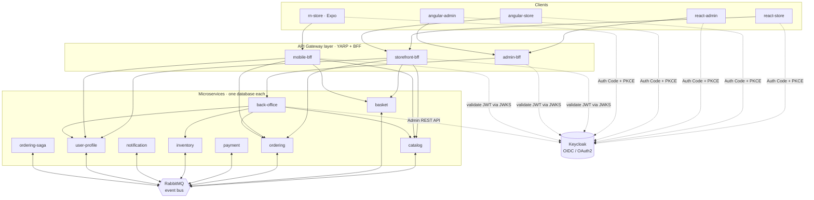

# E-Commerce — a reference .NET microservices platform

A production-grade, deliberately over-documented e-commerce platform built to demonstrate — correctly and
idiomatically — every architectural concept in Microsoft's
[.NET Microservices: Architecture for Containerized .NET Applications](https://learn.microsoft.com/en-us/dotnet/architecture/microservices/),
plus the full-stack and system-design topics a senior .NET engineer is expected to defend in an interview.

> **This repository optimises for explanation, not for shipping speed.** Every non-trivial decision is
> recorded in [`docs/adr/`](docs/adr/) and every pattern is explained in
> [`docs/concept-map.md`](docs/concept-map.md) with the interview question it answers.

---

## Status

| Phase | Scope | State |
|-------|-------|-------|
| 1 | Repo, solution skeleton, building blocks, compose scaffolding, CI, docs tree | 🚧 in progress |
| 2 | Keycloak realm, `Auth` building block, authorization model | ⬜ not started |
| 3 | Shared web foundation (`design-tokens`, `shared`) + **both** storefront shells with OIDC login | ⬜ not started |
| 4 | Catalog + Storefront BFF + browse/search/detail — **React and Angular together** | ⬜ not started |
| 5 | User Profile + My Account — **both frontends** | ⬜ not started |
| 6 | Basket + Ordering (DDD/CQRS) + event bus + outbox + cart/checkout UI — **both frontends** | ⬜ not started |
| 7 | Payment + Inventory + Notification + Saga; order timeline in **both frontends** | ⬜ not started |
| 8 | Back-office + Admin BFF + **both admin shells** (permission-gated routing, data table) | ⬜ not started |
| 9 | Admin catalog / orders / inventory — **both admin panels** | ⬜ not started |
| 10 | Admin user management, roles & permissions, dashboard, audit log — **both admin panels** | ⬜ not started |
| 11 | React Native (Expo) app reusing `/web/shared` | ⬜ not started |
| 12 | Resiliency / observability / security hardening | ⬜ not started |
| 13 | Final pass — coverage, docs audit, fresh-machine walkthrough | ⬜ not started |

**Frameworks are built in lockstep.** No phase is complete until the same Playwright specs pass against both
the React and the Angular app and [`web/parity-checklist.md`](web/parity-checklist.md) has no gaps.
Documentation ships in the same PR as the code it describes — Phase 13 audits docs, it does not write them.

---

## System at a glance



A fuller treatment — bounded contexts, why the boundaries fall where they do, the context map with its
upstream/downstream relationships, and the full service catalogue — lives in
[`docs/architecture.md`](docs/architecture.md).

---

## Running it

> **Prerequisites:** Docker Desktop (Linux containers) and ~8 GB of free RAM. Nothing else — the .NET SDK
> and Node are only needed if you want to run a service outside its container.

```bash
git clone https://github.com/rakshins10/E-Commerce.git
cd E-Commerce/deploy
cp .env.example .env          # dev-only values; see the warning below
docker compose up -d
```

_Filled in at the end of Phase 1 with the real endpoint table._

| Surface | URL |
|---------|-----|
| React storefront | http://localhost:3000 |
| React admin | http://localhost:3001 |
| Angular storefront | http://localhost:4200 |
| Angular admin | http://localhost:4201 |
| Keycloak | http://localhost:8080 |
| RabbitMQ management | http://localhost:15672 |
| Seq (logs) | http://localhost:8081 |
| Jaeger (traces) | http://localhost:16686 |

### ⚠️ On the committed credentials

Every credential in this repository — in `deploy/.env.example`, in
`identity/keycloak/realm-export.json`, in the seed-user table below — is a **development-only fixture**,
generated for this repo and valid only against a throwaway local container. They exist so that
`docker compose up` produces a system you can actually log into and demo in one command, with no
click-ops. **They are not secrets, they are not reused anywhere, and nothing in this repo should ever be
deployed as-is.** Production wiring (env injection, Key Vault, sealed secrets) is described in
[`docs/adr/`](docs/adr/).

---

## Seed users

_Populated in Phase 2 when the Keycloak realm lands._

| Username | Password | Realm role | Can demo |
|----------|----------|------------|----------|
| _tbd_ | | `customer` | shopping, checkout, own order history |
| _tbd_ | | `catalog-manager` | product/category CRUD, pricing |
| _tbd_ | | `order-manager` | order search, status changes, refunds |
| _tbd_ | | `support-agent` | read-only order + profile lookup |
| _tbd_ | | `admin` | everything, incl. user & role management |

---

## Concept map — where each idea is implemented

The interview cheat sheet: every concept from the Microsoft guide, and the exact file that demonstrates it.
This table is grown at the end of every phase; see [`docs/concept-map.md`](docs/concept-map.md) for the
3–5 sentence explanation of each.

| Concept | Implemented in | Phase |
|---------|----------------|-------|
| _populated as each phase lands_ | | |

---

## Repository layout

```
/src
  /services/{user-profile,catalog,basket,ordering,payment,inventory,notification,back-office}
  /gateways/{storefront-bff,admin-bff,mobile-bff}
  /building-blocks/{EventBus,EventBus.RabbitMQ,Common,Observability,Auth}
/web
  /react-store  /react-admin  /angular-store  /angular-admin
  /design-tokens              # colours, spacing, type, radii — one source for web + mobile
  /shared                     # framework-neutral TS: API client, OIDC, permission helpers, validation
  /ui-spec                    # framework-agnostic screen specs both implementations must satisfy
  parity-checklist.md         # every screen/behaviour × React status × Angular status
/mobile/rn-store
/identity/keycloak            # realm-export.json — realm, clients, roles, groups, seed users
/tests/{unit,integration,contract,e2e}
/deploy                       # docker-compose + .env.example
/docs                         # see the documentation index below
```

---

## Documentation

Documentation is a first-class deliverable, written in the same PR as the code it describes. Diagrams are
committed as Mermaid source, never binary images, so they diff and review like code.
Start at **[`docs/README.md`](docs/README.md)** — every topic is reachable in two clicks.

| Document | What it covers |
|----------|----------------|
| [`docs/getting-started.md`](docs/getting-started.md) | Clean-machine setup: tooling, ports, env vars, first run, verification, troubleshooting |
| [`docs/architecture.md`](docs/architecture.md) | C4 context/container/component, topology, communication styles |
| [`docs/domain/`](docs/domain/) | Ubiquitous-language glossary, per-context pages, business rules, process narratives |
| [`docs/services/`](docs/services/) | One page per service, including the complete endpoint reference |
| [`docs/events/event-catalogue.md`](docs/events/event-catalogue.md) | Every integration event: schema, publisher, subscribers, idempotency, failure behaviour |
| [`docs/frontend/`](docs/frontend/) | Screen-by-screen catalogue for storefront and admin, plus the shared layer |
| [`docs/diagrams/`](docs/diagrams/) | Mermaid source — C4, sequence, ERD, state machine, event flow, deployment |
| [`docs/adr/`](docs/adr/) | Architecture Decision Records — the *why* behind each choice |
| [`docs/concept-map.md`](docs/concept-map.md) | Every pattern → what it is, why it's here, the interview question it answers |
| [`docs/authorization-model.md`](docs/authorization-model.md) | Full role/permission matrix and what each one guards |
| [`docs/react-vs-angular.md`](docs/react-vs-angular.md) | Per-feature comparison of the two implementations, written as they are built |
| [`docs/operations/`](docs/operations/) | Health checks, logging/tracing worked examples, runbook |
| [`CONTRIBUTING.md`](CONTRIBUTING.md) | Branch and commit conventions |

## License

[MIT](LICENSE)
