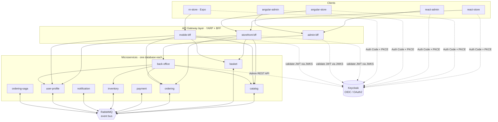

# E-Commerce — a reference .NET microservices platform

A production-grade, deliberately over-documented e-commerce platform built to demonstrate — correctly and
idiomatically — every architectural concept in Microsoft's
[.NET Microservices: Architecture for Containerized .NET Applications](https://learn.microsoft.com/en-us/dotnet/architecture/microservices/),
plus the full-stack and system-design topics a senior .NET engineer is expected to defend in an interview.

> **This repository optimises for explanation, not for shipping speed.** Every non-trivial decision is
> recorded in [`docs/adr/`](docs/adr/) and every pattern is explained in
> [`docs/concept-map.md`](docs/concept-map.md) with the interview question it answers.

---

## Status

| Phase | Scope | State |
|-------|-------|-------|
| 1 | Repo, solution skeleton, building blocks, compose scaffolding, CI, docs tree | 🚧 in progress |
| 2 | Keycloak realm, `Auth` building block, authorization model | ⬜ not started |
| 3 | Shared web foundation (`design-tokens`, `shared`) + **both** storefront shells with OIDC login | ⬜ not started |
| 4 | Catalog + Storefront BFF + browse/search/detail — **React and Angular together** | ⬜ not started |
| 5 | User Profile + My Account — **both frontends** | ⬜ not started |
| 6 | Basket + Ordering (DDD/CQRS) + event bus + outbox + cart/checkout UI — **both frontends** | ⬜ not started |
| 7 | Payment + Inventory + Notification + Saga; order timeline in **both frontends** | ⬜ not started |
| 8 | Back-office + Admin BFF + **both admin shells** (permission-gated routing, data table) | ⬜ not started |
| 9 | Admin catalog / orders / inventory — **both admin panels** | ⬜ not started |
| 10 | Admin user management, roles & permissions, dashboard, audit log — **both admin panels** | ⬜ not started |
| 11 | React Native (Expo) app reusing `/web/shared` | ⬜ not started |
| 12 | Resiliency / observability / security hardening | ⬜ not started |
| 13 | Final pass — coverage, docs audit, fresh-machine walkthrough | ⬜ not started |

**Frameworks are built in lockstep.** No phase is complete until the same Playwright specs pass against both
the React and the Angular app and [`web/parity-checklist.md`](web/parity-checklist.md) has no gaps.
Documentation ships in the same PR as the code it describes — Phase 13 audits docs, it does not write them.

---

## System at a glance



A fuller treatment — bounded contexts, why the boundaries fall where they do, the context map with its
upstream/downstream relationships, and the full service catalogue — lives in
[`docs/architecture.md`](docs/architecture.md).

---

## Running it

> **Prerequisites:** Docker Desktop (Linux containers) and ~8 GB of free RAM. Nothing else — the .NET SDK
> and Node are only needed if you want to run a service outside its container.

```bash
git clone https://github.com/rakshins10/E-Commerce.git
cd E-Commerce/deploy
cp .env.example .env          # dev-only values; see the warning below
docker compose up -d
```

This brings up **27 containers**. First run takes 10–25 minutes (image pulls plus twelve .NET builds);
afterwards it is about 60 seconds. Use `docker compose up -d --wait` to block until everything reports
healthy — it also fails if a service starts and then crashes, which a plain `up -d` reports as success.

| Surface | URL | Status |
|---------|-----|--------|
| **Keycloak** | http://localhost:8080 | ✅ live (`admin` / `dev_only_kc_admin_pw`) |
| **RabbitMQ management** | http://localhost:15672 | ✅ live (`ecom` / `dev_only_rabbit_pw`) |
| **Seq** — structured logs | http://localhost:8081 | ✅ live, no login in dev |
| **Jaeger** — distributed traces | http://localhost:16686 | ✅ live |
| Services — REST | http://localhost:5001–5009 | ✅ live (identity + health only) |
| Services — gRPC | localhost:5101–5107 | Phase 4 |
| Storefront BFF | http://localhost:6001 | ✅ boots; routes in Phase 4 |
| Admin BFF | http://localhost:6002 | ✅ boots; routes in Phase 8 |
| Mobile BFF | http://localhost:6003 | ✅ boots; routes in Phase 11 |
| React storefront | http://localhost:3000 | Phase 3 |
| Angular storefront | http://localhost:4200 | Phase 3 |
| React admin | http://localhost:3001 | Phase 8 |
| Angular admin | http://localhost:4201 | Phase 8 |

Quick check that it works:

```bash
curl http://localhost:5001/                 # {"service":"catalog","status":"up",...}
curl http://localhost:5001/health/live      # liveness  — self only
curl http://localhost:5001/health/ready     # readiness — dependencies
curl -i -H "X-Correlation-Id: demo" http://localhost:5001/   # echoed back
```

Per-service Postgres instances are published on `15432`–`15440` so you can point psql or DataGrip at any one
of them. The full port allocation is in [`deploy/.env.example`](deploy/.env.example).

### ⚠️ On the committed credentials

Every credential in this repository — in `deploy/.env.example`, in
`identity/keycloak/realm-export.json`, in the seed-user table below — is a **development-only fixture**,
generated for this repo and valid only against a throwaway local container. They exist so that
`docker compose up` produces a system you can actually log into and demo in one command, with no
click-ops. **They are not secrets, they are not reused anywhere, and nothing in this repo should ever be
deployed as-is.** Production wiring (env injection, Key Vault, sealed secrets) is described in
[`docs/adr/`](docs/adr/).

---

## Seed users

_Populated in Phase 2 when the Keycloak realm lands._

| Username | Password | Realm role | Can demo |
|----------|----------|------------|----------|
| _tbd_ | | `customer` | shopping, checkout, own order history |
| _tbd_ | | `catalog-manager` | product/category CRUD, pricing |
| _tbd_ | | `order-manager` | order search, status changes, refunds |
| _tbd_ | | `support-agent` | read-only order + profile lookup |
| _tbd_ | | `admin` | everything, incl. user & role management |

---

## Concept map — where each idea is implemented

The interview cheat sheet: every concept from the Microsoft guide, and the exact file that demonstrates it.
This table is grown at the end of every phase; see [`docs/concept-map.md`](docs/concept-map.md) for the
3–5 sentence explanation of each.

| Concept | Implemented in | Phase |
|---------|----------------|-------|
| Bounded contexts & how boundaries were drawn | [`docs/domain/bounded-contexts.md`](docs/domain/bounded-contexts.md) | 1 |
| Database per service / data sovereignty | 9 DB containers in [`deploy/docker-compose.yml`](deploy/docker-compose.yml) · [ADR-0003](docs/adr/0003-postgresql-and-polyglot-persistence.md) | 1 |
| Polyglot persistence | [ADR-0003](docs/adr/0003-postgresql-and-polyglot-persistence.md) | 1 |
| Entity (identity equality) | [`Common/SeedWork/Entity.cs`](src/building-blocks/Common/SeedWork/Entity.cs) | 1 |
| Value object (structural equality) | [`Common/SeedWork/ValueObject.cs`](src/building-blocks/Common/SeedWork/ValueObject.cs) | 1 |
| Aggregate & aggregate root | [`Common/SeedWork/IAggregateRoot.cs`](src/building-blocks/Common/SeedWork/IAggregateRoot.cs) | 1 |
| Domain events vs integration events | [`IDomainEvent.cs`](src/building-blocks/Common/SeedWork/IDomainEvent.cs) vs [`IntegrationEvent.cs`](src/building-blocks/EventBus/IntegrationEvent.cs) | 1 |
| Repository + Unit of Work | [`Common/SeedWork/IRepository.cs`](src/building-blocks/Common/SeedWork/IRepository.cs) | 1 |
| Guard clauses / invariants | [`Common/Guards/Guard.cs`](src/building-blocks/Common/Guards/Guard.cs) | 1 |
| Result type vs exceptions | [`Common/Results/Result.cs`](src/building-blocks/Common/Results/Result.cs) | 1 |
| Event bus abstraction (swappable transport) | [`EventBus/IEventBus.cs`](src/building-blocks/EventBus/IEventBus.cs) · [ADR-0016](docs/adr/0016-rabbitmq-behind-ieventbus.md) | 1 |
| Publish/subscribe, competing consumers, DLQ | [`RabbitMqEventBus.cs`](src/building-blocks/EventBus.RabbitMQ/RabbitMqEventBus.cs) | 1 |
| Idempotent consumer (contract + rationale) | [`IIntegrationEventHandler.cs`](src/building-blocks/EventBus/IIntegrationEventHandler.cs) | 1 |
| Retry with exponential backoff + jitter | [`RabbitMqConnection.cs`](src/building-blocks/EventBus.RabbitMQ/RabbitMqConnection.cs) | 1 |
| Health checks — liveness vs readiness | [`HealthCheckExtensions.cs`](src/building-blocks/Observability/HealthCheckExtensions.cs) · [docs](docs/operations/health-checks.md) | 1 |
| Structured logging + correlation IDs | [`CorrelationId.cs`](src/building-blocks/Observability/CorrelationId.cs) | 1 |
| Distributed tracing (OpenTelemetry) | [`ObservabilityExtensions.cs`](src/building-blocks/Observability/ObservabilityExtensions.cs) | 1 |
| API gateway / BFF pattern | [`src/gateways/`](src/gateways/) · [ADR-0006](docs/adr/0006-yarp-gateway-and-bff-per-client.md) | 1 (shells) |
| Architecture boundary enforcement | [`tests/unit/ECommerce.Architecture.Tests`](tests/unit/ECommerce.Architecture.Tests/) | 1 |
| Transactional Outbox | [ADR-0010](docs/adr/0010-transactional-outbox.md) | 6 |
| Saga + compensating transactions | [ADR-0011](docs/adr/0011-orchestration-saga.md) | 7 |
| CQRS + MediatR pipeline behaviours | [ADR-0012](docs/adr/0012-cqrs-with-mediatr.md) | 6 |
| OIDC / PKCE, permission-based policies | [ADR-0005](docs/adr/0005-keycloak-as-identity-provider.md) · [authorization model](docs/authorization-model.md) | 2 |

Every entry above with a phase later than 1 is **decided and argued in an ADR**, not yet coded — the
reasoning is written first so the code has something to conform to.
[`docs/concept-map.md`](docs/concept-map.md) gives each one a full explanation and the interview question it
answers.

---

## Repository layout

```
/src
  /services/{user-profile,catalog,basket,ordering,payment,inventory,notification,back-office}
  /gateways/{storefront-bff,admin-bff,mobile-bff}
  /building-blocks/{EventBus,EventBus.RabbitMQ,Common,Observability,Auth}
/web
  /react-store  /react-admin  /angular-store  /angular-admin
  /design-tokens              # colours, spacing, type, radii — one source for web + mobile
  /shared                     # framework-neutral TS: API client, OIDC, permission helpers, validation
  /ui-spec                    # framework-agnostic screen specs both implementations must satisfy
  parity-checklist.md         # every screen/behaviour × React status × Angular status
/mobile/rn-store
/identity/keycloak            # realm-export.json — realm, clients, roles, groups, seed users
/tests/{unit,integration,contract,e2e}
/deploy                       # docker-compose + .env.example
/docs                         # see the documentation index below
```

---

## Documentation

Documentation is a first-class deliverable, written in the same PR as the code it describes. Diagrams are
committed as Mermaid source, never binary images, so they diff and review like code.
Start at **[`docs/README.md`](docs/README.md)** — every topic is reachable in two clicks.

| Document | What it covers |
|----------|----------------|
| [`docs/getting-started.md`](docs/getting-started.md) | Clean-machine setup: tooling, ports, env vars, first run, verification, troubleshooting |
| [`docs/architecture.md`](docs/architecture.md) | C4 context/container/component, topology, communication styles |
| [`docs/domain/`](docs/domain/) | Ubiquitous-language glossary, per-context pages, business rules, process narratives |
| [`docs/services/`](docs/services/) | One page per service, including the complete endpoint reference |
| [`docs/events/event-catalogue.md`](docs/events/event-catalogue.md) | Every integration event: schema, publisher, subscribers, idempotency, failure behaviour |
| [`docs/frontend/`](docs/frontend/) | Screen-by-screen catalogue for storefront and admin, plus the shared layer |
| [`docs/diagrams/`](docs/diagrams/) | Mermaid source — C4, sequence, ERD, state machine, event flow, deployment |
| [`docs/adr/`](docs/adr/) | Architecture Decision Records — the *why* behind each choice |
| [`docs/concept-map.md`](docs/concept-map.md) | Every pattern → what it is, why it's here, the interview question it answers |
| [`docs/authorization-model.md`](docs/authorization-model.md) | Full role/permission matrix and what each one guards |
| [`docs/react-vs-angular.md`](docs/react-vs-angular.md) | Per-feature comparison of the two implementations, written as they are built |
| [`docs/operations/`](docs/operations/) | Health checks, logging/tracing worked examples, runbook |
| [`CONTRIBUTING.md`](CONTRIBUTING.md) | Branch and commit conventions |

## License

[MIT](LICENSE)
