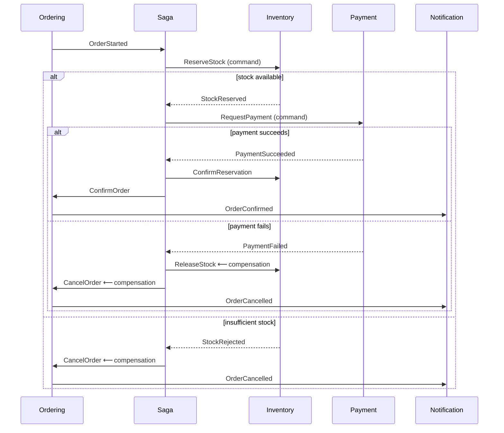

# ADR-0011: Orchestration-based saga, not choreography

- **Status:** Accepted
- **Date:** 2026-07-25
- **Phase:** 1 (implemented in Phase 7)

## Context

Placing an order spans four services that each own their own database:

1. **Ordering** — create the order in `Submitted`
2. **Inventory** — reserve stock for every line
3. **Payment** — charge the customer
4. **Ordering** — confirm the order; **Notification** — tell the customer

There is no distributed transaction ([ADR-0002](0002-microservices-over-modular-monolith.md)), so the
sequence can fail halfway with real-world side effects already committed. If payment fails **after** stock
was reserved, that stock must be released or it is leaked — permanently unsellable inventory, which is a
direct revenue loss and the kind of bug that is invisible until someone counts.

A **saga** is the answer: a sequence of local transactions where each step has a **compensating action**
that semantically undoes it. Compensation is not rollback — you cannot un-send an email or un-charge a card;
you send a correction, or you issue a refund. **Compensating actions are business operations, not technical
ones**, and that distinction is the substance of the pattern.

The decision is *how the sequence is coordinated*.

## Options considered

### Option A — Choreography
No coordinator. Each service subscribes to the previous service's event and emits its own. Inventory hears
`OrderStarted` and emits `StockReserved`; Payment hears that and emits `PaymentSucceeded`; Ordering hears
that and confirms.

Real strengths: maximum decoupling, no single point of failure, no component that knows about everyone, and
adding a participant can require no change to existing services.

Why it fails here:

- **The process exists nowhere.** No file describes the order flow. To answer "what happens when an order is
  placed?" you read six services and reconstruct it. The flow is *emergent* — the most expensive kind of
  undocumented.
- **Compensation is smeared everywhere.** Payment failure must release stock, so Inventory subscribes to
  `PaymentFailed`. Now Inventory knows about payment. Add a fraud check and every downstream participant
  learns about fraud. The decoupling is illusory: you traded explicit coupling for implicit, undiscoverable
  coupling.
- **No place to put process state.** "Which orders are stuck between reservation and payment?" has no
  owner and no query.
- **Timeouts have no home.** If Payment never responds, whose job is it to notice? In choreography, nobody's.
- **Cyclic event chains** become genuinely hard to reason about and easy to create by accident.

Choreography is the right choice for **simple, linear, notification-shaped flows with no compensation** —
for example `OrderConfirmed → Notification sends an email`. It is used here for exactly that.

### Option B — Orchestration (process manager)
A dedicated `ordering-saga` service holds the process state, sends commands to participants, receives
replies, and decides the next step or the compensation.

### Option C — A workflow engine (Temporal, Elsa, Dapr Workflows)
Durable execution, retries, timers, and visibility out of the box — genuinely excellent, and what a real team
with this problem should seriously evaluate.

Rejected here because it would hide the mechanism. The repository's purpose is to demonstrate *how* a saga
maintains consistency; delegating that to a framework would leave the reader — and the interviewee — unable
to explain what the framework does. In production this is a strong option and it should be said so.

## Decision

**Orchestration.** A dedicated `ordering-saga` service is the process manager, communicating with
participants **only over the event bus** — commands out, replies in. It makes no synchronous calls, which is
what lets it survive a participant being offline: the command waits in a queue.

### The flow

Every branch is explicit, in one file, and testable by driving the state machine with fabricated replies —
no infrastructure required.

### Why stock is reserved before payment

Reserving first and charging second means a failed payment releases a reservation — annoying but harmless.
Charging first and failing to reserve means refunding a customer for goods that do not exist — a support
incident and a trust problem. **Order the steps so that the cheapest compensation is the most likely one.**
That heuristic generalises well and is worth stating explicitly.

### Saga state, timeouts, and idempotency

The saga persists its state per order (current step, timestamps, outcomes) in its own database, which:

- makes "which orders are stuck?" an ordinary SQL query;
- lets a restarted saga resume rather than lose in-flight processes;
- gives the admin order-timeline screen its data source
  ([docs/frontend/admin](../frontend/README.md)).

**Timeouts are first-class.** Each step has a deadline; a step exceeding it is treated as failed and
compensation runs. Without this, a lost reply strands an order forever — the single most common saga bug.

The saga is **idempotent** in both directions, because delivery is at-least-once
([ADR-0010](0010-transactional-outbox.md)): a duplicate reply for an already-advanced step is ignored, and
every command carries the saga instance id so participants can deduplicate.

## Consequences

### What this buys us
- The business process is **one readable, testable artefact**.
- Compensation logic lives in one place instead of being distributed across participants.
- Process state is queryable — stuck orders are findable, and the admin timeline is a real feature.
- Timeouts have an obvious owner.
- Participants stay ignorant of each other: Inventory knows nothing about Payment.
- Adding or reordering a step is a change to one service.

### What this costs us
- **A single point of coordination.** If the saga is down, no order progresses. Mitigated because
  communication is asynchronous — commands and replies queue and drain on recovery — but it is a real
  availability dependency, and pretending otherwise would be dishonest.
- **The orchestrator knows about everyone**, which is genuine coupling. It is *explicit, centralised,
  documented* coupling rather than diffuse coupling, which is the trade being made.
- **Eventual consistency is now visible to users.** An order is `Submitted` for a moment before becoming
  `Confirmed`, and the UI must show that honestly rather than pretending it is instant.
- **Compensation is not rollback.** A refunded payment leaves a charge and a refund on the customer's
  statement. That is a product decision surfaced by the architecture, not hidden by it.
- **Testing requires discipline** — every failure branch and every timeout needs a test, and it is easy to
  cover only the happy path.

### What we will have to revisit
If the process grows past roughly a dozen steps, or gains human-in-the-loop approvals, long timers, or
versioning of in-flight instances, hand-rolled orchestration stops being the cheapest option and a durable
workflow engine (Option C) becomes correct. The state machine's shape should survive that migration.

## References

- [.NET microservices guide — saga pattern](https://learn.microsoft.com/en-us/dotnet/architecture/microservices/)
- [microservices.io — Saga](https://microservices.io/patterns/data/saga.html)
- [ADR-0010](0010-transactional-outbox.md) — the delivery guarantee this depends on
- [diagrams/sequence-checkout.md](../diagrams/README.md) — every path, including compensation
