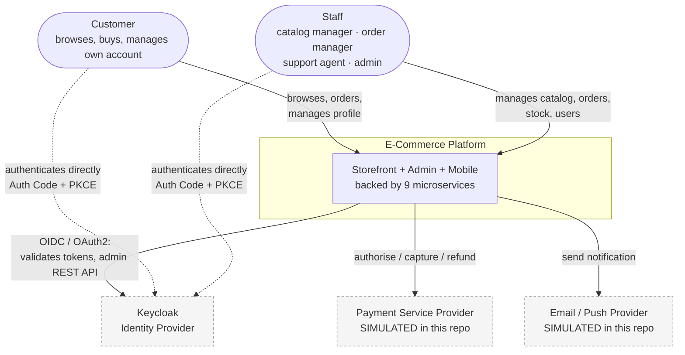
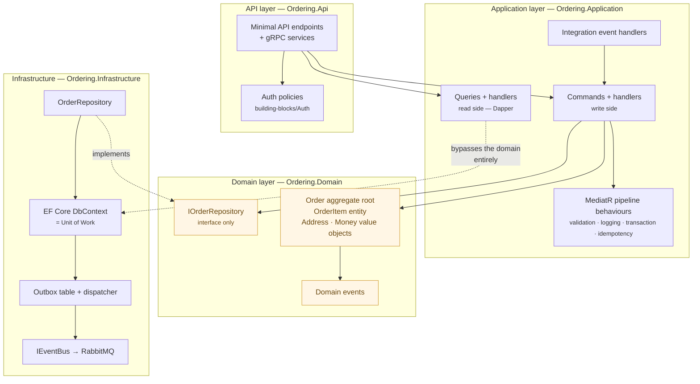

# Architecture

> **Related:** [Bounded contexts](domain/bounded-contexts.md) · [Concept map](concept-map.md) ·
> [ADR index](adr/README.md) · [Deployment topology](diagrams/deployment.md)

This page describes the system top-down using the [C4 model](https://c4model.com/) — context, then
containers, then the internal structure of a service — and then explains the two decisions that shape
everything else: **how services communicate** and **how data is owned**.

---

## 1. The honest framing: should this be microservices at all?

A senior engineer should be able to answer "why microservices?" without reciting marketing. So, plainly:

**For a store of this size, microservices are the wrong production choice.** A well-structured modular
monolith — the same bounded contexts as assemblies with enforced module boundaries, one database with a
schema per module, one deployable — would give you most of the design benefit at a fraction of the
operational cost. You would get ACID transactions instead of sagas, in-process calls instead of network
failure modes, one thing to deploy, one place to look when something breaks. Microservices buy you
**independent deployability, independent scaling, and technology heterogeneity**, and they charge you in
**distributed-systems tax**: eventual consistency, partial failure, distributed tracing, network latency,
schema versioning across the wire, and a much harder local dev story.

That trade is worth making when teams need to ship independently, when parts of the system have genuinely
different scaling profiles (Catalog reads dwarf Ordering writes), or when a component's availability
requirements differ sharply from its neighbours'. It is not worth making because the architecture is
fashionable.

**This repository is a teaching artifact.** It uses microservices because its purpose is to demonstrate the
patterns in Microsoft's [.NET microservices guide](https://learn.microsoft.com/en-us/dotnet/architecture/microservices/)
correctly and in context. Everywhere a pattern is heavier than the domain strictly requires, that is stated.
See [ADR-0002](adr/0002-microservices-over-modular-monolith.md) for the full argument — including the
migration path a real team would take (start monolith, extract along context seams when a seam actually
hurts).

> **Interview question this answers:** *"When would you not use microservices?"* — and the follow-up,
> *"How would you decide when to extract a service from a monolith?"*

---

## 2. C4 Level 1 — System context

Who uses the system, and what it depends on.

Two things worth noticing:

**Users authenticate *directly against Keycloak*, not through our application.** The dotted lines are the
browser redirecting to Keycloak's login page. Our services never see a password. This is the whole point of
delegating identity — see [ADR-0005](adr/0005-keycloak-as-identity-provider.md).

**The payment and notification providers are simulated.** Real integrations are out of scope; what is *not*
simplified is the surrounding machinery — the outbox, the retries, the saga compensation. Those behave as
they would in production. Each simulation is labelled in its service page.

---

## 3. C4 Level 2 — Containers

Every deployable unit and every datastore. This is the diagram to have open during an interview.

```mermaid
graph TB
    subgraph clients["Client applications"]
        direction LR
        RS["react-store<br/><small>Vite · TanStack Query · RTK</small>"]
        AS["angular-store<br/><small>standalone · signals · NgRx</small>"]
        RA["react-admin"]
        AA["angular-admin"]
        MOB["rn-store<br/><small>Expo</small>"]
    end

    subgraph edge["Edge — API gateway layer"]
        direction LR
        SBFF["storefront-bff<br/><small>YARP + aggregation</small>"]
        ABFF["admin-bff<br/><small>YARP + aggregation</small>"]
        MBFF["mobile-bff<br/><small>chattier, coarser payloads</small>"]
    end

    subgraph core["Microservices"]
        direction LR
        CAT["catalog"]
        BAS["basket"]
        ORD["ordering"]
        USR["user-profile"]
        INV["inventory"]
        PAY["payment"]
        NOT["notification"]
        SAGA["ordering-saga<br/><small>process manager</small>"]
        BO["back-office"]
    end

    subgraph data["Datastores — one per service"]
        direction LR
        CATDB[("catalog<br/>Postgres")]
        CATRD[("catalog read<br/>Mongo")]
        BASDB[("basket<br/>Redis")]
        ORDDB[("ordering<br/>Postgres")]
        USRDB[("user-profile<br/>Postgres")]
        INVDB[("inventory<br/>Postgres")]
        PAYDB[("payment<br/>Postgres")]
        NOTDB[("notification<br/>Postgres")]
        SAGADB[("saga state<br/>Postgres")]
        BODB[("audit log<br/>Postgres")]
    end

    KC["Keycloak"]
    KCDB[("keycloak<br/>Postgres")]
    MQ{{"RabbitMQ<br/>topic exchange"}}
    OBS["Seq · Jaeger<br/><small>OTLP</small>"]

    RS & AS --> SBFF
    RA & AA --> ABFF
    MOB --> MBFF

    SBFF --> CAT & BAS & ORD & USR
    MBFF --> CAT & BAS & ORD & USR
    ABFF --> BO
    BO --> CAT & ORD & INV & USR
    BO -.->|Admin REST API| KC

    CAT --- CATDB & CATRD
    BAS --- BASDB
    ORD --- ORDDB
    USR --- USRDB
    INV --- INVDB
    PAY --- PAYDB
    NOT --- NOTDB
    SAGA --- SAGADB
    BO --- BODB
    KC --- KCDB

    CAT & BAS & ORD & USR & INV & PAY & NOT & SAGA & BO <-->|integration events| MQ
    core -.->|traces · metrics · logs| OBS
    edge -.->|traces · metrics · logs| OBS

    classDef db fill:#eef4ff,stroke:#5b7fbd,color:#1c3a6e
    class CATDB,CATRD,BASDB,ORDDB,USRDB,INVDB,PAYDB,NOTDB,SAGADB,BODB,KCDB db
```

### Reading the diagram

- **Solid arrows between services are synchronous** (HTTP or gRPC). There are deliberately very few of them.
- **The double-headed arrows to RabbitMQ are asynchronous** integration events. This is the primary
  integration mechanism — see §6.
- **No arrow ever crosses from one service into another service's datastore.** That is the rule that makes
  this a microservice architecture rather than a distributed monolith. See §7.
- **The saga talks to nobody synchronously.** It sends commands and receives replies over the bus, which is
  what lets it survive a downstream service being offline. See [ADR-0011](adr/0011-orchestration-saga.md).

---

## 4. C4 Level 3 — Anatomy of a service

The transactional services (Ordering above all, but the shape is the same everywhere the domain is
non-trivial) use a **Clean/Onion layering** with dependencies pointing inward:

Four things this drawing is making explicit, each of which is a common interview question:

1. **The domain layer references nothing.** No EF Core, no MediatR, no ASP.NET. It is plain C# enforcing
   business invariants. `IOrderRepository` is *declared* in the domain (it is a domain concept — "somewhere
   I can get an Order") and *implemented* in infrastructure. That inversion is what "dependencies point
   inward" means concretely.
2. **The query side skips the domain model.** `QRY` has a dotted line straight past the aggregate. Loading a
   full `Order` aggregate to render a list of order summaries is waste; the read side projects directly to
   DTOs. That asymmetry *is* CQRS. See [ADR-0012](adr/0012-cqrs-with-mediatr.md).
3. **The `DbContext` is the Unit of Work.** We do not write a separate `IUnitOfWork` wrapper — `SaveChanges`
   already is one, committing the aggregate's changes and its outbox rows in a single transaction.
4. **Events leave through the outbox, never directly.** A handler that publishes to RabbitMQ inside its own
   transaction can commit the database and then fail to publish (or publish and then fail to commit). The
   outbox makes the write and the intent-to-publish atomic. See [ADR-0010](adr/0010-transactional-outbox.md).

Not every service earns this structure. Basket is a thin Redis-backed CRUD service and gets a single
project — imposing four layers on it would be cargo-culting. **Complexity is spent where the domain is
complex.**

---

## 5. Service catalogue

| Service | Bounded context | Type | Datastore | Sync surface | Primary responsibility |
|---------|-----------------|------|-----------|--------------|------------------------|
| **catalog** | Catalog | Supporting | Postgres (write) + Mongo (read model) | REST, gRPC | Products, categories, brands, search, pricing, images |
| **basket** | Basket | Supporting | Redis | REST, gRPC | Per-user cart; reacts to price/stock changes |
| **ordering** | Ordering | **Core** | Postgres | REST, gRPC | `Order` aggregate, order state machine, full DDD + CQRS |
| **payment** | Payment | Generic | Postgres | — (events only) | Simulated PSP; authorise / capture / refund |
| **inventory** | Inventory | Supporting | Postgres | REST, gRPC | Stock levels, reservations, release |
| **notification** | Notification | Generic | Postgres | — (events only) | Email/push dispatch honouring user channel preferences |
| **user-profile** | Customer Profile | Supporting | Postgres | REST, gRPC | Display name, addresses, preferences, wishlists, consents |
| **ordering-saga** | Order Fulfilment | **Core** (process) | Postgres | — (events only) | Orchestrates order → stock → payment → confirm, with compensation |
| **back-office** | Administration | Supporting | Postgres (audit only) | REST | Admin operations across services; wraps Keycloak Admin API; audit log |
| **storefront-bff** | — (edge) | Gateway | none | REST | Routes + aggregates for the two storefronts |
| **admin-bff** | — (edge) | Gateway | none | REST | Routes + aggregates for the two admin panels |
| **mobile-bff** | — (edge) | Gateway | none | REST | Coarser, fewer, larger payloads for mobile |

"Core / Supporting / Generic" is the DDD subdomain classification, and it is a *budgeting* tool: core
subdomains get the rich domain model and the careful design; generic subdomains would be bought off the
shelf in production (Payment → Stripe, Notification → SendGrid, Identity → Keycloak, which is exactly what
we did). See [domain/bounded-contexts.md](domain/bounded-contexts.md).

---

## 6. Communication: choosing synchronous or asynchronous

This is the single most consequential design axis in a microservice system, so the rule is written down
rather than decided case by case.

### The default is asynchronous

**If service A needs to tell service B that something happened, that is an event, and it goes on the bus.**
Synchronous calls between services create runtime coupling: A's availability becomes the product of its own
availability and B's, latency compounds, and a slow B exhausts A's thread/connection pool and takes A down
with it. A message broker decouples them in time — B can be down for a minute and the message waits.

### Synchronous is allowed only for queries the caller cannot proceed without

| Call | Style | Why |
|------|-------|-----|
| BFF → any service | **REST** | The client is waiting on a screen. There is no "later". |
| Basket → Catalog: *is this price still valid?* | **gRPC** | Needed *now*, in the request path, to render a correct cart. Small, hot, internal, strongly typed. |
| Ordering → Catalog: *snapshot name and price at checkout* | **gRPC** | Must be captured at the moment of ordering. Afterwards the order is independent — see below. |
| Notification → User Profile: *which channels has this user opted into?* | **gRPC** + cache | Needed to dispatch; cached aggressively because preferences change rarely. |
| Back-office → Keycloak Admin API | **REST** | Keycloak's published interface; we conform to it. |
| Everything else | **Events** | Stock reservation, payment, order confirmation, profile provisioning, price-change propagation, notification dispatch. |

### Why gRPC internally and REST at the edge

REST over JSON is the right choice at the edge: browsers speak it natively, it is cacheable, debuggable with
`curl`, and versionable with content negotiation. Internally none of that matters, and gRPC's advantages
start to: a `.proto` file is a **compiler-enforced contract** shared by client and server, Protobuf is
markedly smaller and faster to serialise than JSON, and HTTP/2 multiplexes many calls over one connection.
The cost is tooling and browser support — which is precisely why it stops at the BFF.
See [ADR-0007](adr/0007-grpc-for-internal-sync-calls.md).

### The snapshot rule

When Ordering creates an order, it copies the product name and unit price into the `OrderItem`. It does not
store a reference to be resolved later. This is not denormalisation for performance — **it is domain
correctness**: an order records what the customer agreed to pay, and a price change next Tuesday must not
retroactively alter last week's order. It also happens to sever the runtime dependency, which is the
general shape of a well-drawn boundary: *the right domain answer and the right coupling answer agree.*

### Why three BFFs rather than one gateway

A single gateway serving five clients becomes a **coupling magnet and a deployment bottleneck**. Every
client's needs land in one codebase, so a change the mobile app needs is deployed to a component the admin
panel depends on; the aggregation logic accumulates conditionals (`if (client == "mobile")`); and one team's
release cadence gates everyone's.

The Backends-for-Frontends pattern gives each client family its own edge, owned by the team that owns that
client:

- **storefront-bff** — public-facing, aggressively cached, aggregates product + stock + price into one
  product-page payload, and serves the two storefronts identically.
- **admin-bff** — different threat model entirely. Every route is permission-gated, every mutation is
  audit-logged, and it fans out across services for administrative views.
- **mobile-bff** — optimised for latency and battery over a mobile network: fewer round trips, coarser
  payloads, more aggressive pagination.

Note the deliberate asymmetry: **the React and Angular storefronts share one BFF.** A BFF exists per *client
experience*, not per *framework*. Two apps with identical UX have identical data needs, so splitting them
would be duplication with no benefit — and it is what makes their parity provable in the first place.
See [ADR-0006](adr/0006-yarp-gateway-and-bff-per-client.md).

---

## 7. Data sovereignty: why services never share a database

**Every service owns its data exclusively. No service reads another's tables. There are no cross-service
foreign keys and no cross-service joins.**

This is the rule most often broken in practice, and breaking it converts a microservice architecture into a
**distributed monolith** — the worst of both worlds. If Ordering reads Catalog's `Products` table, then
Catalog can no longer change that schema without coordinating a release with Ordering; the boundary exists
on the org chart but not in the code; and you have paid the entire distributed-systems tax while keeping
every constraint of a monolith. Shared databases also create shared failure and contention: one service's
runaway query degrades everyone.

**What you give up:** the foreign key. There is no database-level guarantee that an order's `ProductId`
points at a real product. That constraint moves into the domain — validated at order time via gRPC, and
maintained afterwards by the snapshot rule.

**What you give up next:** the join. "Show me orders with product images" spans two services. The answer is
one of: aggregate at the BFF (fine for a page of results); maintain a read model fed by events (right when
the query is hot or the join is wide); or accept that the query does not belong in the transactional path at
all and belongs in analytics.

**What you get:** each service can change its schema, its indexes, even its database engine, without asking
permission. Basket uses Redis because a cart is a short-lived key-value blob with a TTL. Catalog's query
side uses Mongo because product documents are read-heavy and denormalised. Ordering uses Postgres because
orders need ACID and relational integrity within the aggregate. **Polyglot persistence is a consequence of
sovereignty, not a goal in itself.**

See [ADR-0003](adr/0003-postgresql-and-polyglot-persistence.md).

---

## 8. Cross-cutting building blocks

Shared libraries under `src/building-blocks/`. The discipline here matters: **a shared library between
microservices is a coupling point**, so these contain only genuinely generic infrastructure — never domain
logic, never DTOs shared between two services' APIs.

| Library | Contains | Why it is safe to share |
|---------|----------|-------------------------|
| `Common` | Result types, domain-event base types, guard clauses, pagination primitives, `ProblemDetails` error contract | Language-level utilities. No domain meaning. |
| `EventBus` | `IEventBus`, `IntegrationEvent`, `IIntegrationEventHandler<T>`, subscription manager | Abstraction only, zero transport dependency — this is what makes RabbitMQ swappable for Azure Service Bus. |
| `EventBus.RabbitMQ` | The RabbitMQ implementation: connection management, publisher confirms, consumer wiring, retry/DLQ | One implementation of the above. Referenced only in composition roots. |
| `Observability` | Serilog + OpenTelemetry setup, correlation-ID propagation, health-check conventions | Pure infrastructure. Ensures every service is observable identically. |
| `Auth` | JWT validation, permission policies, `IAuthorizationRequirement`/handlers, resource-based authorization, `ICurrentUser` | Security must be uniform. Reimplementing token validation per service is how services drift and holes appear. |

**What deliberately is *not* here:** integration event *contracts*. It is tempting to put every event class
in a shared assembly, but that produces a lockstep-deployment shared kernel — change one event and every
service must recompile. Instead, each publisher owns its events as a **Published Language** and ships them
as a small, independently versioned contracts package that subscribers reference. Consumers tolerate unknown
fields, so additive changes need no coordinated release. See
[events/event-catalogue.md](events/event-catalogue.md).

---

## 9. Port allocation

Every port is declared in [`deploy/.env.example`](../deploy/.env.example) and nothing hardcodes one.
The scheme:

| Range | Used for |
|-------|----------|
| `3000–3001` | React web apps (store, admin) |
| `4200–4201` | Angular web apps (store, admin) |
| `5001–5009` | Microservice **REST/HTTP** endpoints |
| `5101–5107` | Microservice **gRPC** endpoints (service's HTTP port + 100) |
| `6001–6003` | BFFs (storefront, admin, mobile) |
| `6006` | Storybook |
| `8080` | Keycloak |
| `8081`, `5341` | Seq UI, Seq ingest |
| `15672`, `5672` | RabbitMQ management, AMQP |
| `16686`, `4317/4318` | Jaeger UI, OTLP gRPC/HTTP |
| `15432–15440` | Postgres containers (one host port per service database) |
| `6379`, `27017` | Redis, MongoDB |

gRPC gets its own port because Kestrel cannot multiplex HTTP/1.1 and HTTP/2 on the same **plaintext** port,
and TLS between containers is out of scope here. In production behind TLS, both would share 443.
Full detail in [getting-started.md](getting-started.md) and [diagrams/deployment.md](diagrams/deployment.md).

---

## 10. What this system deliberately does not do

Being explicit about scope is part of the design.

| Not built | Why | What production would do |
|-----------|-----|--------------------------|
| Kubernetes manifests | Compose demonstrates the same topology with far less ceremony. Services are configured so K8s could be layered on — no hardcoded hosts, config from env, liveness/readiness split already correct. | Helm chart or Kustomize overlays; HPA on Catalog. |
| Real payment gateway | Requires credentials and a sandbox account. | Stripe/Adyen with idempotency keys, webhook verification, PCI scope reduction via hosted fields. |
| Real email/push | Same. | SendGrid/FCM with per-provider bounce and delivery-receipt handling. |
| TLS between containers | Certificate management would dominate the setup instructions. | mTLS via a service mesh, or terminate at ingress with mesh-internal mTLS. |
| Multi-region / DR | No value for the concepts being demonstrated. | Active-passive with per-service RPO/RTO targets. |
| Schema registry | Contract tests cover the same failure mode at this scale. | Confluent Schema Registry or equivalent, with compatibility checks in CI. |

---

## Where to go next

- **The domain, properly:** [domain/bounded-contexts.md](domain/bounded-contexts.md) — why each boundary sits
  where it does, told context by context.
- **The patterns, indexed:** [concept-map.md](concept-map.md) — every pattern, where it lives, and the
  interview question it answers.
- **The decisions, argued:** [adr/README.md](adr/README.md).
- **Running it:** [getting-started.md](getting-started.md).
