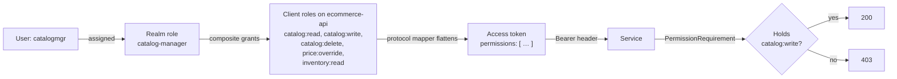

# Authorization model

> **New to this?** [`concepts-explained.md §18`](concepts-explained.md#18-roles-vs-permissions) explains roles
> vs permissions in plain English first.
>
> **Related:** [ADR-0005 — Keycloak as IdP](adr/0005-keycloak-as-identity-provider.md) ·
> [`identity/keycloak/realm-export.json`](../identity/keycloak/realm-export.json) ·
> [`src/building-blocks/Auth/`](../src/building-blocks/Auth/)

The complete role and permission design: what exists, what grants what, what guards what, and why it is built
this way.

Everything on this page is **verified by tests** in
[`tests/integration/ECommerce.Auth.IntegrationTests`](../tests/integration/ECommerce.Auth.IntegrationTests/),
which run against a real Keycloak container importing this exact realm file. If the realm and this document
ever disagree, the tests fail.

---

## 1. The design in one paragraph

Keycloak holds **two layers**. *Realm roles* are coarse job titles (`customer`, `catalog-manager`).
*Client roles* on the `ecommerce-api` client are fine-grained permissions (`catalog:write`, `order:refund`).
Realm roles are **composite** — each one grants a set of permissions. A protocol mapper flattens those
permissions into a `permissions` claim on the access token. In .NET, **every endpoint requires a permission,
never a role.**

---

## 2. Why permissions, not roles

Guarding an endpoint by job title looks natural and ages badly:

```csharp
[Authorize(Roles = "admin,order-manager")]      // ❌
public void RefundOrder() { }
```

Then the business says *"support agents should be able to issue refunds too."* Now you must find **every**
place a refund is guarded and add `support-agent`. The ones you miss keep working the old way — silently,
with no error, no log, and no failing test. **Authorization bugs that fail permissively are the ones nobody
notices.**

Guarding by capability inverts it:

```csharp
app.MapPost("/orders/{id}/refund", RefundOrder)      // ✅
   .RequirePermission(Permissions.Order.Refund);
```

That line **never changes again.** Which roles hold `order:refund` is configuration in Keycloak, expressed as
a composite role. Granting it to support agents is a settings change with **no deployment at all**.

The trade-off, stated honestly: there is now a second place to look. Reading the code tells you an endpoint
needs `order:refund`; it does not tell you who has it. That is what this page is for, and it is why the
matrix below is maintained rather than left implicit.

---

## 3. Permissions

Client roles on the `ecommerce-api` client. Naming is `resource:action`, with an optional `:own` suffix
marking a permission that **cannot be decided from the token alone** — see §7.

| Permission | Grants |
|------------|--------|
| `catalog:read` | View products, categories, brands |
| `catalog:write` | Create and edit catalog entries |
| `catalog:delete` | Delete catalog entries |
| `price:override` | Set a price outside the normal pricing rules |
| `order:read` | View **any** order |
| `order:read:own` | View only orders you placed yourself |
| `order:write` | Place an order, change its status |
| `order:cancel` | Cancel an order |
| `order:refund` | Refund a paid order |
| `inventory:read` | View stock levels |
| `inventory:adjust` | Adjust stock levels |
| `user:read` | Search and view users |
| `user:manage` | Enable, disable, reset password |
| `user:roles:manage` | Assign roles and groups |
| `basket:read:own` | View your own basket |
| `basket:write:own` | Change your own basket |
| `profile:read:own` | View your own profile |
| `profile:write:own` | Edit your own profile, addresses, preferences |
| `audit:read` | Read the administrative audit log |
| `dashboard:read` | View sales and order KPIs |

Mirrored in code as constants in [`Permissions.cs`](../src/building-blocks/Auth/Permissions.cs), so a typo is
a build error rather than a silently-failing check.

---

## 4. The matrix — which role grants what

**✅ = granted.** Everything a role holds arrives through its composite; nothing is assigned to users
directly.

| Permission | `customer` | `support-agent` | `catalog-manager` | `order-manager` | `admin` |
|------------|:---:|:---:|:---:|:---:|:---:|
| `catalog:read` | ✅ | ✅ | ✅ | ✅ | ✅ |
| `catalog:write` | | | ✅ | | ✅ |
| `catalog:delete` | | | ✅ | | ✅ |
| `price:override` | | | ✅ | | ✅ |
| `order:read` | | ✅ | | ✅ | ✅ |
| `order:read:own` | ✅ | | | | |
| `order:write` | ✅ | | | ✅ | ✅ |
| `order:cancel` | | | | ✅ | ✅ |
| `order:refund` | | | | ✅ | ✅ |
| `inventory:read` | | ✅ | ✅ | ✅ | ✅ |
| `inventory:adjust` | | | | ✅ | ✅ |
| `user:read` | | ✅ | | | ✅ |
| `user:manage` | | | | | ✅ |
| `user:roles:manage` | | | | | ✅ |
| `basket:read:own` | ✅ | ✅ | ✅ | ✅ | ✅ |
| `basket:write:own` | ✅ | ✅ | ✅ | ✅ | ✅ |
| `profile:read:own` | ✅ | ✅ | ✅ | ✅ | ✅ |
| `profile:write:own` | ✅ | ✅ | ✅ | ✅ | ✅ |
| `audit:read` | | | | | ✅ |
| `dashboard:read` | | | | | ✅ |
| **Total** | **7** | **8** | **9** | **11** | **19** |

Five deliberate properties of this table:

**Support is read-only.** `support-agent` can see orders and users and change nothing. A helpdesk needs to
answer questions, not to act — and separating `order:read` from `order:refund` is exactly what makes that
expressible.

**Roles are scoped by job, not stacked by seniority.** `catalog-manager` cannot refund an order;
`order-manager` cannot edit the catalog. Neither is "more senior". This is the principle of least privilege
applied to job function, and it is asserted in
[`AuthorizationTests`](../tests/integration/ECommerce.Auth.IntegrationTests/AuthorizationTests.cs).

**`admin` is a *nested* composite.** It does not list catalog or order permissions itself — it is composed of
`support-agent` + `catalog-manager` + `order-manager`, plus user administration. So a permission added to
`catalog-manager` next month **automatically reaches admin**, with no edit to admin at all. That is the
maintainability payoff of composites, and a test asserts it.

**`profile:*:own` and `basket:*:own` are on every role, because every role is held by a person.** Profile
was originally granted to `customer` alone, and the Phase 5 e2e suite caught it: signing in as `ordermgr`
and opening My Account returned `403 Forbidden`. The tempting fix is to change the test. The correct fix
was to change the model — a warehouse supervisor still has a display name, a delivery address and a
marketing preference, and "staff accounts have no profile" is not a rule anyone actually wanted. Basket
followed the same rule from the start.

> The general lesson: a permission that reads *"…your own X"* belongs to **everyone who logs in**, not to
> one role, because holding it grants access to exactly one thing — the caller's own. Permissions that
> grant power over *other people's* data are the ones to scope by job.

**`order:read:own` is the one that stays customer-only, and it needed a different fix.** It is not on
staff roles because staff read orders through `order:read` — the right to read *any* order — which is a
genuinely different scope rather than the same thing under another name. But that left a gap Phase 6 found:
a member of staff who buys something from their own shop got `403` on **their own** order history.

The wrong fix would have been to grant `order:read:own` to everyone, which would blur two permissions that
mean different things. The right fix was at the endpoint:

```csharp
group.MapGet("/me", GetMyOrders)
    .RequireAnyPermission(Permissions.Order.Read, Permissions.Order.ReadOwn);
```

`/orders/me` is always filtered to the caller's `sub` server-side, so someone allowed to read *any* order
can self-evidently read their own. **Either permission opens the door; which one you hold decides what the
query returns.** That keeps the two permissions meaning exactly what their names say.

---

## 5. How a permission reaches the code



The **protocol mapper** is the piece worth noticing. Keycloak's default shape is
`resource_access.ecommerce-api.roles`, which is awkward to read. A mapper in the realm flattens it into a
top-level `permissions` array, so .NET reads one simple string collection.

You can see this yourself against the running stack:

```bash
curl -s -X POST http://localhost:8080/realms/ecommerce/protocol/openid-connect/token \
  -d grant_type=password -d client_id=test-harness \
  -d client_secret=dev_only_test_harness_secret \
  -d username=catalogmgr -d password='Passw0rd!' | jq -r .access_token
```

Paste the result into [jwt.io](https://jwt.io) — you will see `permissions`, `realm_access.roles`, and
`aud: ecommerce-api`.

---

## 6. Token validation — what every service checks

Configured once in [`AuthenticationExtensions.cs`](../src/building-blocks/Auth/AuthenticationExtensions.cs)
and applied identically everywhere, because nine services each configuring this by hand is nine chances to
omit something.

| Check | Why |
|-------|-----|
| **Signature** against the realm's JWKS | Proves Keycloak issued it. Keys are fetched once at startup and cached, so there is no network call per request. |
| **Issuer** (`iss`) | Proves it came from *our* realm, not another realm on the same server. |
| **Lifetime** (`exp`) with 30s skew | Default skew is 5 minutes, which means an expired token keeps working for 5 more. |
| **Audience** (`aud` = `ecommerce-api`) | **The check most often skipped.** Without it, a token minted for a different application by the same realm is accepted here — and if that app has a laxer login policy, it becomes a way in. |

**Validated twice, deliberately** — at the BFF and again at the service. The gateway is not a trust boundary
worth betting everything on: a misconfiguration, a future internal caller, or a compromised container must
still meet authentication at the service itself. Defence in depth.

---

## 7. Resource-based authorization — "only your own orders"

Every rule so far is answerable from the token alone. This one is not:

> A customer may read only **their own** orders.

The token says who you are. It says nothing about who owns order #12345. The decision needs **the resource**,
which is only known after loading it — which is exactly why ASP.NET Core has a second, imperative
authorization API.

```csharp
Order? order = await repository.GetByIdAsync(id, ct);
if (order is null) return Results.NotFound();

AuthorizationResult result = await authorizationService.AuthorizeAsync(
    user, order, new ResourceOwnerRequirement(Permissions.Order.ReadOwn, Permissions.Order.Read));

if (!result.Succeeded) return Results.NotFound();   // note: NOT Forbid — see below
```

[`ResourceOwnerRequirement`](../src/building-blocks/Auth/ResourceOwnerRequirement.cs) takes two permissions:
the "own" one and an optional override for staff. Staff holding `order:read` skip the ownership check
entirely; a customer must hold `order:read:own` **and** actually be the owner.

### Return 404, not 403, for someone else's resource

A `403` confirms the order **exists**. An attacker can then enumerate valid order ids by watching which
return 403 and which return 404. Returning `404` for both "does not exist" and "not yours" leaks nothing.

Staff endpoints, where existence is not sensitive, can legitimately return `403` — the distinction is whether
the *existence* of the resource is information worth protecting.

---

## 8. Groups

Groups mirror the role structure and exist for **operational convenience**, not as a separate concept:

```
/customers                → customer
/staff/support            → support-agent
/staff/merchandising      → catalog-manager
/staff/fulfilment         → order-manager
/staff/administrators     → admin
```

Adding someone to `/staff/fulfilment` grants `order-manager` and everything it composes. Useful when onboarding
maps naturally to teams, and it means an admin manages *membership* rather than reasoning about roles.

Note that **nothing in the code ever checks a group.** Groups grant roles; roles grant permissions;
permissions guard endpoints. Adding a group check would be a fourth mechanism doing the same job.

---

## 9. Clients

| Client | Type | Secret? | Used by |
|--------|------|:---:|---------|
| `ecommerce-api` | bearer-only | — | Not an app. Owns the permission roles and is the **audience** every service validates. |
| `storefront-react` | public + PKCE | **no** | React storefront (:3000) |
| `storefront-angular` | public + PKCE | **no** | Angular storefront (:4200) |
| `admin-react` | public + PKCE | **no** | React admin (:3001) |
| `admin-angular` | public + PKCE | **no** | Angular admin (:4201) |
| `mobile` | public + PKCE | **no** | Expo app, system browser |
| `storefront-bff` | confidential | yes | Storefront BFF |
| `admin-bff` | confidential | yes | Admin BFF |
| `mobile-bff` | confidential | yes | Mobile BFF |
| `back-office-service` | confidential | yes | Calls the Keycloak Admin REST API |
| `ordering-saga-service` | confidential | yes | Service-to-service |
| `test-harness` | confidential | yes | **Tests only** — the sole client with the password grant enabled |

### Why public clients hold no secret

A secret shipped inside a JavaScript bundle or an app binary **is not a secret** — anyone can open devtools
or unzip the APK. So these clients have none, and use **PKCE** instead: the app invents a random verifier,
sends only its hash to start the flow, and must present the original to redeem the code. An intercepted
authorization code is useless without it.

Each app gets its **own** client so redirect URIs are exact, and so one compromised application can be
disabled without touching the others.

### Why `test-harness` exists

Tests need a real token for a named user without driving a browser, which means the password grant — a grant
deprecated in OAuth 2.1 and one that must never be enabled on a real application client. Isolating it in a
single test-only client keeps every real client clean while still letting authorization tests assert against
**genuine Keycloak-signed tokens** rather than hand-forged ones. A forged token would only test the test's own
assumptions about issuer, audience and claim shape — precisely the things most likely to be wrong.

---

## 10. Endpoint guard reference

Filled in as each service is built. The pattern is fixed: **the permission is declared on the route**, so a
reader can audit a service's entire authorization surface by scanning its route table — and an unprotected
endpoint shows up as an *absence*, which is far easier to spot in review than a missing check buried in a
method body.

| Endpoint | Permission | Extra check | Phase |
|----------|-----------|-------------|-------|
| `GET /catalog/products` | *(public)* | — | 4 ✅ |
| `GET /catalog/products/{id}` | *(public)* | — | 4 ✅ |
| `GET /catalog/categories` | *(public)* | — | 4 ✅ |
| `GET /catalog/brands` | *(public)* | — | 4 ✅ |
| `GET /profile/me` | `profile:read:own` | **`sub`** | 5 ✅ |
| `PUT /profile/me/contact` | `profile:write:own` | **`sub`** | 5 ✅ |
| `PUT /profile/me/preferences` | `profile:write:own` | **`sub`** | 5 ✅ |
| `POST /profile/me/addresses` | `profile:write:own` | **`sub`** | 5 ✅ |
| `PUT /profile/me/addresses/{id}` | `profile:write:own` | **`sub`** | 5 ✅ |
| `DELETE /profile/me/addresses/{id}` | `profile:write:own` | **`sub`** | 5 ✅ |
| `POST /profile/me/addresses/{id}/default-shipping` | `profile:write:own` | **`sub`** | 5 ✅ |
| `POST /profile/me/addresses/{id}/default-billing` | `profile:write:own` | **`sub`** | 5 ✅ |
| `GET /basket/me` | `basket:read:own` | **`sub`** | 6 ✅ |
| `POST /basket/me/items` | `basket:write:own` | **`sub`** | 6 ✅ |
| `PUT /basket/me/items/{id}` | `basket:write:own` | **`sub`** | 6 ✅ |
| `DELETE /basket/me/items/{id}` | `basket:write:own` | **`sub`** | 6 ✅ |
| `DELETE /basket/me` | `basket:write:own` | **`sub`** | 6 ✅ |
| `POST /catalog/products` | `catalog:write` | — | 9 |
| `PUT /catalog/products/{id}` | `catalog:write` | — | 9 |
| `DELETE /catalog/products/{id}` | `catalog:delete` | — | 9 |
| `PUT /catalog/products/{id}/price` | `price:override` | — | 9 |
| `POST /orders` | `order:write` | — | 6 ✅ |
| `GET /orders/me` | `order:read` OR `order:read:own` | **`sub`** | 6 ✅ |
| `GET /orders/{id}` | `order:read` OR `order:read:own` | **owner** | 6 ✅ |
| `POST /orders/{id}/cancel` | `order:cancel` OR `order:read:own` | owner or staff | 6 ✅ |
| `POST /orders/{id}/confirm-stock` | `inventory:adjust` | — | 6 ✅ |
| `POST /orders/{id}/pay` | `order:write` | — | 6 ✅ |
| `POST /orders/{id}/ship` | `order:cancel` | — | 6 ✅ |
| `POST /orders/{id}/deliver` | `order:cancel` | — | 6 ✅ |
| `POST /orders/{id}/refund` | `order:refund` | — | 7 |
| `GET /inventory` | `inventory:read` | — | 7 |
| `POST /inventory/{sku}/adjust` | `inventory:adjust` | — | 7 |
| `GET /admin/users` | `user:read` | — | 8 |
| `POST /admin/users/{id}/enable` | `user:manage` | — | 8 |
| `POST /admin/users/{id}/roles` | `user:roles:manage` | — | 8 |
| `GET /admin/audit` | `audit:read` | — | 8 |
| `GET /admin/dashboard` | `dashboard:read` | — | 8 |

**✅ = built and covered by tests.** Rows without it are the planned surface for a later phase, listed here
so the authorization design is visible before the code exists.

**On the `sub` column.** Every profile route ends in `/me`, and "me" is resolved **server-side from the
`sub` claim** — there is no `/profile/{userId}` route to attack, and no request body carries a user id.
The permission answers *"may this kind of user touch profiles at all?"*; the `sub` lookup answers *"whose?"*.
Splitting those two questions is the reason `profile:read:own` can safely be granted to every role: holding
it grants access to exactly one profile, the caller's own. Compare `GET /orders/{id}`, where the id **is**
in the URL and therefore needs a genuine resource-based check
([`ResourceOwnerRequirement`](../src/building-blocks/Auth/ResourceOwnerRequirement.cs)).

---

## 11. The UI hides; the server enforces

Both admin panels hide actions the token does not permit, and route guards prevent navigating to pages the
user cannot use.

**That is user experience, not security.** Anyone can open devtools, copy the token, and call the API
directly. Hiding a button prevents an honest user attempting something that will fail; it prevents a
dishonest one from nothing.

So **every rule enforced in a screen is independently enforced on the server**, and there is a test for it:
[`AuthorizationTests`](../tests/integration/ECommerce.Auth.IntegrationTests/AuthorizationTests.cs) calls
protected endpoints with lower-privileged tokens and requires rejection. That test is what proves the server
does not rely on the UI having hidden anything.

The shared [`hasPermission()`](../web/shared/) helper reads the same `permissions` claim the server checks, so
the two cannot drift in their *understanding* of what a permission is — only in whether they enforce it, and
the server always does.

---

## 12. Token size, and when this design stops scaling

Composite roles expand into the token, so every permission a user holds becomes a claim. Our `admin` token
carries 15. That is comfortable.

At a few hundred fine-grained permissions it stops being comfortable: tokens grow past header limits (many
proxies default to 8 KB), and the cost is paid on **every request to every service**. Mitigations, in order
of preference:

1. **Keep permissions coarse enough to count.** Most systems that reach hundreds have modelled per-record
   rules as permissions, which is the actual mistake.
2. **Scope per client**, so an application's token carries only what that application needs.
3. **Look them up server-side** — only as a last resort, since it reintroduces a network call into the
   authorization path.

---

## 13. Keycloak Authorization Services / UMA — considered, not used

Keycloak can act as a full **policy decision point**: you define resources, scopes and policies inside
Keycloak, and services *ask it* whether a given action is permitted. Genuinely more powerful, and the right
answer when permissions depend on runtime data too complex to put in a token — "may this user approve this
invoice, given its amount and their department's limit?"

Not used here because:

- **It adds a network call to the authorization path of every request.** Our model decides offline from the
  token; UMA asks Keycloak.
- **It moves policy out of the codebase** into a console, where it is harder to review, version, and diff.
- **It is substantially heavier than this domain needs.** Our rules are "does this user hold this
  capability", which a claim answers perfectly.

Knowing it exists and being able to say **why you did not use it** is the more useful position than either
adopting it uncritically or not knowing about it.

---

## 14. Seed users

Every role has a demo account, so any flow can be exercised immediately after `docker compose up`.

| Username | Password | Role | Permissions | Demonstrates |
|----------|----------|------|:---:|--------------|
| `customer` | `Passw0rd!` | `customer` | 5 | Browsing, checkout, own orders and profile |
| `support` | `Passw0rd!` | `support-agent` | 4 | Read-only helpdesk — can look, cannot act |
| `catalogmgr` | `Passw0rd!` | `catalog-manager` | 5 | Product and price management |
| `ordermgr` | `Passw0rd!` | `order-manager` | 7 | Order management, refunds, stock adjustment |
| `administrator` | `Passw0rd!` | `admin` | 15 | Everything, including user administration |
| `blocked` | `Passw0rd!` | `customer` | — | **Disabled account** — cannot log in at all |

Keycloak admin console: http://localhost:8080 — `admin` / `dev_only_kc_admin_pw`

> **These are development fixtures.** They are published deliberately, because publishing them is harmless:
> they are valid only against a throwaway local container. See
> [ADR-0009](adr/0009-secrets-management.md).

The `blocked` user exists so the enable/disable flow can be demonstrated without breaking a working account —
and it proves that disabling happens *in Keycloak*, failing at authentication before our authorization layer
is ever reached.
