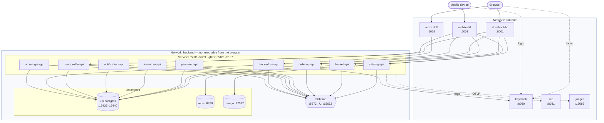
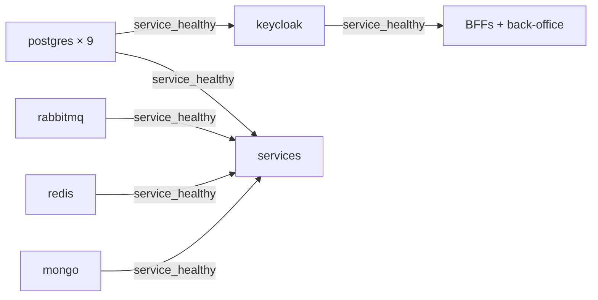

# Deployment topology

> **Source:** [`deploy/docker-compose.yml`](../../deploy/docker-compose.yml) ·
> **Related:** [Getting started](../getting-started.md) · [Architecture](../architecture.md)

What `docker compose up` actually creates: 27 containers on two networks.

## Why two networks

Databases and the broker sit **only** on `backend`, which the browser cannot reach. The BFFs and Keycloak are
the only containers bridging both. This is defence in depth: a compromised web container has no route to
Postgres, because there is no network path — not merely because it lacks a password.

In production this becomes a network policy or a security group. Expressing it in Compose now means the
intent is already recorded, rather than being reconstructed at deployment time.

## Dependency and startup ordering

Two things worth noticing:

**`condition: service_healthy`, never a fixed sleep.** Postgres accepts TCP connections several seconds
before it can serve queries, and Keycloak takes 30–60 seconds to import its realm. A `sleep 30` is both too
long on a fast machine and too short on a loaded one — it is a race condition with a comfortable-looking
number attached.

**No service depends on another service.** Only on infrastructure. That is the whole point of asynchronous
integration: startup order between services must not matter, and if it did, the coupling would be real
regardless of what the architecture diagram claimed. It is also what makes the ordering in this graph so
shallow.

## Volumes

One named volume per stateful container. `docker compose down` keeps them; `down -v` deletes them.

> **Postgres 18 note.** The 18 images changed the data-directory convention: the mount must be at
> `/var/lib/postgresql`, not `/var/lib/postgresql/data` as for 17 and earlier. Mounting the old path makes
> the container refuse to start, reporting "PostgreSQL data in (unused mount/volume)" — which reads like a
> corruption warning rather than a configuration error. This bit during Phase 1.

## What differs in production

| Here | Production |
|------|-----------|
| 9 Postgres containers | One managed cluster, a database and a dedicated login per service |
| `start-dev`, plain HTTP | Keycloak `start` with TLS and `KC_HOSTNAME_STRICT=true` |
| Plaintext between containers | mTLS via a service mesh, or ingress termination plus mesh-internal mTLS |
| Two ports per service | One port on 443; HTTP/1.1 and HTTP/2 multiplex over TLS |
| Secrets in `.env` | Key Vault or External Secrets, with managed identity ([ADR-0009](../adr/0009-secrets-management.md)) |
| Compose health checks with `curl` | Kubelet HTTP probes — no in-container client needed |
| Jaeger all-in-one, in-memory | Tempo/Application Insights with real retention and sampling |
