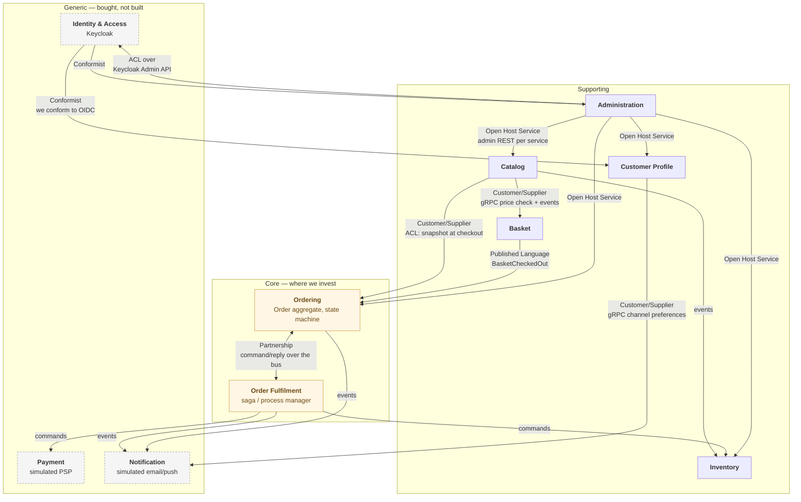

# Bounded contexts

> **Related:** [Architecture](../architecture.md) · [Glossary](glossary.md) ·
> [Context map diagram](../diagrams/README.md) · [ADR-0004: identity vs profile split](../adr/0004-identity-vs-profile-data-split.md)

A **bounded context** is the boundary within which a model — and the language describing it — is consistent
and unambiguous. It is a *linguistic* boundary before it is a technical one. The classic test: if the same
word means two different things to two groups of people, you have found a context boundary.

That test does real work here. "Customer" means three different things in this system:

| To… | "Customer" is… | Which lives in… |
|-----|----------------|-----------------|
| Keycloak | a set of credentials, a `sub`, and a list of realm roles | Identity & Access |
| User Profile | a display name, saved addresses, a locale, marketing consents | Customer Profile |
| Ordering | a `BuyerId` and a shipping address *frozen at the moment of purchase* | Ordering |

Trying to build one canonical `Customer` class that serves all three produces a bloated model that serves
none of them well — every consumer carries fields it does not care about, and any change ripples everywhere.
Three models, each complete for its own purpose, connected by explicit translation, is the correct answer.
**This is the single most important idea on this page.**

---

## How the boundaries were drawn

Four heuristics, applied in order:

1. **Linguistic seams.** Where does a term change meaning? (`Customer`, above. Also `Product` — a rich
   marketing entity in Catalog, a name-and-price snapshot in Ordering, a bare SKU with a count in Inventory.)
2. **Transactional consistency.** What must be atomically consistent? An `Order` and its `OrderItem`s must
   never disagree, so they are one aggregate in one service. An order and the customer's stock reservation
   *may* briefly disagree — that is what the saga reconciles — so they can live apart.
3. **Rate of change and ownership.** Things that change together for the same business reason belong
   together. Pricing rules change with the catalog, not with fulfilment.
4. **Scaling and availability profile.** Catalog reads dwarf everything else and must stay up even when
   Ordering is degraded — a store that cannot take orders but can still be browsed is far better than one
   that is dark.

**Where these heuristics disagreed, transactional consistency won.** Getting an aggregate boundary wrong is
expensive and hard to reverse; getting a service boundary slightly wrong is recoverable.

---

## Subdomain classification

Before the details — the classification, because it is a *budgeting* decision that explains why some
services here are elaborate and others are 200 lines.

| Subdomain type | Meaning | Investment | Here |
|----------------|---------|------------|------|
| **Core** | Where the business differentiates. Complexity is inherent and worth modelling carefully. | Rich domain model, deep design, best people | **Ordering**, **Order Fulfilment** |
| **Supporting** | Necessary, specific to us, but not differentiating. | Pragmatic; straightforward code | Catalog, Basket, Inventory, Customer Profile, Administration |
| **Generic** | Every business needs it; nobody wins by doing it better. | **Buy, don't build** | Identity & Access, Payment, Notification |

Note what this predicts and what actually happened: the three generic subdomains are the three we did *not*
build. Identity is Keycloak. Payment and Notification are simulated adapters standing in for Stripe and
SendGrid — the *integration machinery* around them is real, the providers are not. Meanwhile Ordering gets
aggregates, value objects, domain events, and a state machine. **Spending equal design effort everywhere is
the most common way to run out of budget before the core domain is right.**

---

## The context map

### The relationship patterns used, and why

| Pattern | Where | Meaning |
|---------|-------|---------|
| **Conformist** | Every service → Keycloak | We accept Keycloak's model wholesale. No translation layer over OIDC — the standard *is* the contract, and fighting it would be pure cost. |
| **Anticorruption Layer (ACL)** | Ordering → Catalog; Back-office → Keycloak Admin API | We translate the foreign model into ours at the boundary so it cannot leak inward. Ordering never holds a Catalog `Product`; it holds its own `OrderItem`. Back-office never surfaces Keycloak's `UserRepresentation`; it maps to its own DTO — so replacing Keycloak with Entra ID touches one adapter. |
| **Customer/Supplier** | Catalog → Basket/Ordering; Profile → Notification | Downstream's needs are a legitimate input to upstream's roadmap. Catalog exposes a price-check RPC *because* Basket needs it. |
| **Published Language** | All integration events | Events are a stable, versioned, documented contract — not an internal class accidentally exposed. See [event catalogue](../events/event-catalogue.md). |
| **Open Host Service** | Each service → Back-office | Services expose a deliberate admin-facing API for any number of administrative consumers, rather than bespoke integrations. |
| **Partnership** | Ordering ↔ Order Fulfilment | They succeed or fail together and are designed in tandem. This is the one pair with genuinely bidirectional coupling — see the note under Order Fulfilment. |

**Deliberately absent: Shared Kernel.** No two contexts share a domain model. The
[building blocks](../architecture.md#8-cross-cutting-building-blocks) are shared *infrastructure* only —
never domain types, never DTOs shared between two services' public APIs. A shared kernel across services is
how you arrive at lockstep deployment.

---

## The contexts

### Identity & Access — Keycloak

**Subdomain:** Generic · **Not built by us**

**Owns:** credentials and password hashing, MFA, sessions, token issuance and signing keys, realm roles,
client roles, composite roles, groups, and the clients themselves.

**Deliberately does not own:** anything a merchant would call "customer data". No addresses, no preferences,
no wishlists, no order history.

**Why the boundary:** authentication is a solved, security-critical, zero-differentiation problem. Rolling
your own means owning password hashing, credential-stuffing defence, token revocation, MFA, and account
recovery — forever, correctly, with no upside. See
[ADR-0005](../adr/0005-keycloak-as-identity-provider.md) for the Keycloak vs Entra ID vs Auth0 vs Duende
comparison.

---

### Customer Profile

**Subdomain:** Supporting · **Service:** `user-profile` · **Store:** Postgres

**Owns:** display name, contact details, saved addresses, preferences (locale, currency, theme, marketing
opt-ins, notification channels), wishlists, and consent records — keyed by the Keycloak `sub` claim.

**Deliberately does not own:** passwords, roles, group membership, or anything that decides *what a user may
do*. It never authenticates anyone.

**Why the boundary — the identity/profile split.** This is the subtlest boundary in the system and worth
defending precisely. The two datasets differ on every axis that matters:

| | Identity data | Profile data |
|---|---|---|
| Changes | rarely, security-sensitive | often, user-driven |
| Read by | the auth layer, per request | the storefront, per page |
| Consequence of corruption | account takeover | wrong theme |
| Belongs in the token | yes (`sub`, roles) | no — it would bloat every request |
| Regulatory character | credentials, auditable | personal data, erasable under GDPR |
| Portability | tied to the IdP | tied to the business |

Pushing addresses and marketing preferences into Keycloak user attributes is possible and is a trap: it
couples business data to an infrastructure component, makes it awkward to query and validate, bloats tokens
if mapped into claims, and makes replacing the IdP a data migration instead of a config change. Conversely,
storing password hashes in our service reintroduces exactly the risk Keycloak exists to remove.

**The rule: Keycloak answers "who are you and what may you do"; User Profile answers "what do we know about
you".** The `sub` claim is the only join key, and it is opaque, stable, and never reused.

**Provisioning:** a profile is created on first login, driven by an event rather than a synchronous call, so
a slow profile service can never block a login. See [ADR-0004](../adr/0004-identity-vs-profile-data-split.md).

**Relationships:** Conformist to Keycloak (accepts `sub` as given). Supplier to Notification (channel
preferences over gRPC, cached).

---

### Catalog

**Subdomain:** Supporting · **Service:** `catalog` · **Store:** Postgres (write) + MongoDB (read model)

**Owns:** products, variants, categories, brands, images, descriptions, list prices, search and filtering.

**Deliberately does not own:** stock levels (Inventory) and the price a customer actually paid (Ordering).

**Why the boundary:** merchandising changes on a completely different rhythm and by different people than
fulfilment. It is also read-dominated by orders of magnitude, which justifies the split write/read model:
the write side keeps a normalised relational model with real constraints, while the query side serves
denormalised documents built by projecting domain events. That is CQRS applied where it genuinely pays.

**The stock question.** Displaying "in stock" needs Inventory data — so why not put stock in Catalog?
Because *availability* and *description* have unrelated write patterns: stock changes on every order and
every delivery, product copy changes when marketing decides. Merging them would put a high-churn, contended
write path into a read-optimised, heavily cached service. Instead Catalog subscribes to Inventory's
stock-level events and keeps a **cached approximation** for display. It is eventually consistent and that is
correct: a product page showing "3 left" a few seconds stale is fine, because the authoritative check
happens at reservation time inside the saga. **The place you must be exactly right is the reservation, not
the product page.**

---

### Basket

**Subdomain:** Supporting · **Service:** `basket` · **Store:** Redis

**Owns:** the current cart per user — lines, quantities, and the price captured when each line was added.

**Deliberately does not own:** the authoritative price (Catalog) and anything that survives checkout — at
checkout it publishes `BasketCheckedOut` and the basket is deleted. It has no history.

**Why the boundary:** a cart is high-write, low-value, naturally expiring session state with no complex
invariants and no need for durability guarantees. That profile is nothing like Ordering's, and mixing them
would drag transactional machinery into a hot path that does not need it. Redis is the right store precisely
*because* the data is disposable: key-value access by user id, native TTL, no schema.

**Reacting to price changes** is its most interesting behaviour: on `ProductPriceChanged` it updates affected
carts and flags the change so the UI can say "the price of an item in your basket has changed". This is a
small, honest demonstration of event-driven UX — and a good interview illustration of why a cart holds a
*captured* price rather than a live lookup.

---

### Ordering

**Subdomain:** Core · **Service:** `ordering` · **Store:** Postgres

**Owns:** the `Order` aggregate — order items, the shipping address as a value object, order status and its
state machine, and the order's own history.

**Deliberately does not own:** stock (Inventory), payment execution (Payment), or the orchestration of
fulfilment (Order Fulfilment). Ordering records *what was ordered*; it does not run the process.

**Why the boundary:** this is where the business's rules actually live, and where the invariants are
non-negotiable — an order's total must equal the sum of its lines, a shipped order cannot be cancelled, a
draft order cannot be paid. Those invariants must hold atomically, which makes `Order` + `OrderItem`s a
single aggregate in a single transaction in a single service.

**The aggregate boundary is drawn at consistency, not at convenience.** `OrderItem` is inside because it
cannot be valid independently of its order. The buyer is *outside* — referenced by `BuyerId` only — because
an order does not need the customer record to be transactionally consistent with it. A common novice error
is to pull the whole customer in "because we need their address"; the correct move is to **copy the address
in as a value object at order time**, which is both better domain modelling (the address is frozen at
purchase) and a looser coupling.

Full treatment: [ordering aggregate diagram](../diagrams/README.md),
[order state machine](../diagrams/README.md).

---

### Order Fulfilment — the saga

**Subdomain:** Core (process) · **Service:** `ordering-saga` · **Store:** Postgres

**Owns:** the state of an in-flight order process, the sequencing of its steps, timeouts, and the
compensating actions when a step fails.

**Deliberately does not own:** any business entity. It holds process state, not domain state.

**Why it is separate from Ordering:** because *"what an order is"* and *"how an order gets fulfilled"* change
for different reasons. Adding a fraud-check step, or reordering payment before reservation, is a process
change that should not touch the `Order` aggregate. Keeping the process manager separate also keeps the
aggregate honest — it stays a consistency boundary rather than becoming a workflow engine.

**Why orchestration rather than choreography:** with choreography, each service reacts to the previous
service's event and the overall process exists nowhere — it is emergent, undocumented, and untraceable, and
compensation logic is smeared across every participant. For a flow with real compensation requirements
(reserve stock → take payment → confirm, releasing stock if payment fails), an explicit orchestrator that
you can read, test, and query is worth its coupling cost. Full argument, including what choreography would
look like: [ADR-0011](../adr/0011-orchestration-saga.md).

**Partnership with Ordering** is the one genuinely bidirectional relationship in the map: Ordering emits
`OrderStarted`, the saga drives the process, and the saga tells Ordering to advance or cancel. They are
designed together and versioned together. This is acknowledged rather than hidden — pretending it is a clean
one-way dependency would be dishonest.

---

### Inventory

**Subdomain:** Supporting · **Service:** `inventory` · **Store:** Postgres

**Owns:** stock on hand per SKU, reservations, and stock movements.

**Deliberately does not own:** product descriptions, prices, or anything a customer sees.

**Why the boundary:** stock is the system's most contended resource and its most safety-critical number.
Overselling is a real business cost, so reservation needs proper concurrency control — row-level locking or
optimistic concurrency — in isolation from read traffic. Keeping it in its own service means Catalog's
browse load can never contend with reservation writes.

**Reservation, not decrement.** Stock is *reserved* during the saga and *confirmed* only when payment
succeeds; if payment fails, the reservation is released. A naive decrement-on-order leaks stock permanently
whenever anything downstream fails. The reservation model is what makes compensation possible at all.

---

### Payment

**Subdomain:** Generic · **Service:** `payment` · **Store:** Postgres · **Simulated**

**Owns:** payment attempts, their outcomes, and refunds — as records. Publishes `OrderPaymentSucceeded` /
`OrderPaymentFailed`.

**Deliberately does not own:** card data. In production it never would either — that is what hosted fields
and tokenisation exist for, and it is how PCI scope is kept off your servers.

**Why the boundary:** regulatory isolation is the real driver. Payment has different audit, retention, and
compliance requirements than the rest of the system, and a hard service boundary keeps that blast radius
contained.

**Simplified for this repo:** the gateway is simulated with configurable behaviour
(`PAYMENT_SIMULATOR_MODE`) so failure paths and compensation can be demonstrated on demand. Production adds
a real PSP with idempotency keys, webhook signature verification, 3-D Secure, and reconciliation against the
provider's settlement reports.

---

### Notification

**Subdomain:** Generic · **Service:** `notification` · **Store:** Postgres · **Simulated**

**Owns:** the record of what was sent, to whom, over which channel, and whether it succeeded.

**Deliberately does not own:** the user's channel preferences — those belong to Customer Profile, and it
fetches them.

**Why the boundary:** it is a pure subscriber. It has no API that anyone calls to "send a notification";
it reacts to events. That makes it the cleanest illustration in the system of a fully decoupled consumer —
**you can stop this service entirely and nothing upstream notices or breaks.** Messages queue; they are
delivered when it returns.

---

### Administration

**Subdomain:** Supporting · **Service:** `back-office` · **Store:** Postgres (audit log only)

**Owns:** the audit trail of administrative actions — who did what, to what, when, and from where.

**Deliberately does not own:** users (Keycloak), products (Catalog), orders (Ordering), stock (Inventory).
It stores **no** business data. Every read and write is delegated to the owning service or to Keycloak.

**Why it exists at all:** administrative use cases are genuinely cross-cutting — "suspend this user, cancel
their in-flight orders, and release the stock" spans four contexts. Somewhere must coordinate that and
record it. The alternative, letting the admin UI call six services directly, scatters authorisation and
audit logic into a browser application, which is exactly where it must not live.

**Why it is not just a BFF:** the Admin BFF routes and aggregates; Back-office has real behaviour of its own
— authorisation decisions, the anticorruption layer over the Keycloak Admin API, and an audit log that is a
first-class, tamper-evident record with its own retention requirements. Compliance is a genuine
responsibility, not plumbing.

---

## Applying this in an interview

| Question | Where the answer is |
|----------|--------------------|
| "How do you decide service boundaries?" | The four heuristics above, and the `Customer`-means-three-things example. |
| "Why not one canonical Customer model?" | The table at the top of this page. |
| "Where do you put stock — Catalog or Inventory?" | Catalog §"The stock question" — different write patterns, cached approximation for display, authoritative check at reservation. |
| "How do you handle a foreign key across services?" | You do not. Validate at write time, snapshot the data you need. See [architecture §7](../architecture.md#7-data-sovereignty-why-services-never-share-a-database). |
| "Identity provider or your own user table?" | Customer Profile §"the identity/profile split", and [ADR-0005](../adr/0005-keycloak-as-identity-provider.md). |
| "Choreography or orchestration?" | Order Fulfilment, and [ADR-0011](../adr/0011-orchestration-saga.md). |
| "When is eventual consistency acceptable?" | Product-page stock is; reservation is not. Same page, both halves. |
