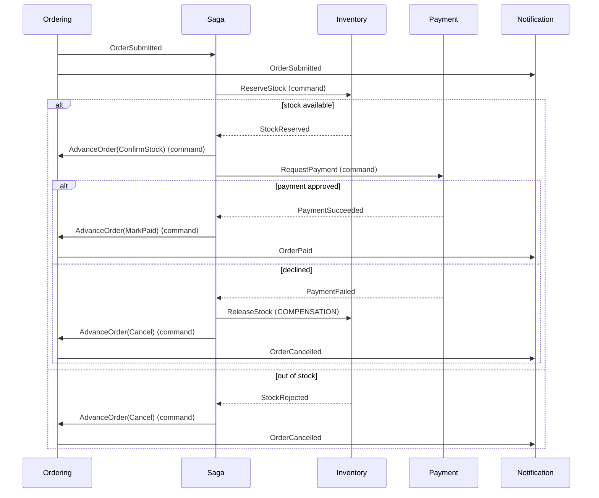

# Integration event catalogue

> **Related:** [ADR-0016 — RabbitMQ behind IEventBus](../adr/0016-rabbitmq-behind-ieventbus.md) ·
> [ADR-0010 — Transactional Outbox](../adr/0010-transactional-outbox.md)

Every integration event in the system: publisher, subscribers, payload, and failure behaviour.

**An integration event is a published contract.** Once another service consumes it, changing it is a breaking
change to someone else's deployment. This catalogue is where that contract lives, and an event that is not
here does not exist as far as other teams are concerned.

## Rules that apply to every event

| Rule | Why |
|------|-----|
| **Past tense, always** — `OrderConfirmed`, never `ConfirmOrder` | An event reports something that has happened and cannot be refused. A subscriber may react; it may not veto. |
| **Primitives and simple DTOs only** | Serialising a domain type exports your internal model as a public contract, so refactoring it breaks a neighbour. |
| **Additive changes only** | Add optional fields; never remove or repurpose one. Consumers tolerate unknown fields, so additive change needs no coordinated release — which is what makes independent deployability real. |
| **Delivery is at-least-once** | Every consumer must be idempotent. Not optional: a duplicate `OrderPaymentSucceeded` handled twice charges a customer twice. |
| **No ordering guarantee** | Concurrent outbox dispatchers can publish out of order. Where order matters, the consumer enforces it with a version number — it is never assumed from the transport. |
| **Published via the outbox** | Never directly from a handler. See [ADR-0010](../adr/0010-transactional-outbox.md). |

## Template

Each event is documented as:

```markdown
### <EventName>

- **Publisher:** service
- **Subscribers:** service (what it does) · service (what it does)
- **Routing key:** EventName
- **Version:** 1

**Payload**
| Field | Type | Notes |
|-------|------|-------|

**Idempotency:** how a duplicate is detected and what happens.
**Ordering:** whether the consumer tolerates out-of-order delivery.
**On failure:** retries, then dead-letter, and the business consequence of the message never being processed.
```


---

## The flow, drawn



**Note the two kinds of arrow.** The saga sends **commands** — imperative, one recipient, may be refused —
and consumes **events** — past tense, broadcast, cannot be refused. They travel over the same broker and
share a base class, so nothing enforces the distinction; keeping it is a discipline. Conflating them is how
an "event" quietly acquires exactly one required listener and stops being an event at all.

---

## Events published by Ordering

### `OrderSubmittedIntegrationEvent`

- **Publisher:** Ordering
- **Subscribers:** Ordering Saga (starts the saga) · Notification (order confirmation email)
- **Version:** 1

| Field | Type | Notes |
|-------|------|-------|
| `OrderId` | Guid | |
| `OrderNumber` | string | Human reference, e.g. `ORD-20260726-4F2A` |
| `BuyerId` | string | Keycloak `sub`. Never an email address |
| `Total` | decimal | |
| `Currency` | string | ISO 4217 |
| `Lines` | array | `ProductId`, `Sku`, `ProductName`, `Quantity`, `UnitPrice` |

**Why it carries the lines.** An event holding only an order id would force Inventory to call back to
Ordering — reintroducing the runtime coupling that asynchronous messaging exists to remove, and meaning
Ordering being down stops Inventory working.

**Idempotency:** the saga uses the order id as its primary key, so a duplicate hits the unique constraint
rather than starting a second saga that reserves stock again. Notification records the message id in
`processed_messages`, in the same transaction as the notification row.
**Ordering:** first event in the flow; nothing precedes it.
**On failure:** retried by the outbox publisher, then dead-lettered. Consequence: the order exists but no
saga starts, so it sits in `Submitted` forever. The `/api/saga/stuck` query is what surfaces that.

### `OrderStockConfirmedIntegrationEvent`

- **Publisher:** Ordering · **Subscribers:** none yet (published for completeness and the timeline)
- **Payload:** `OrderId`, `OrderNumber`

### `OrderPaidIntegrationEvent`

- **Publisher:** Ordering · **Subscribers:** Notification (payment receipt)
- **Payload:** `OrderId`, `OrderNumber`, `BuyerId`, `Total`, `Currency`

**Idempotency:** `Order.MarkAsPaid` returns quietly if the order is already paid, so no second event is
raised. Notification deduplicates on the message id — which matters here more than anywhere, because an
email cannot be un-sent.

### `OrderShippedIntegrationEvent`

- **Publisher:** Ordering · **Subscribers:** Inventory (ships the reservation — the only place `on_hand`
  falls) · Notification (dispatch notice)
- **Payload:** `OrderId`, `OrderNumber`, `BuyerId`

### `OrderDeliveredIntegrationEvent`

- **Publisher:** Ordering · **Subscribers:** none yet
- **Payload:** `OrderId`, `OrderNumber`

### `OrderCancelledIntegrationEvent`

- **Publisher:** Ordering · **Subscribers:** Notification (cancellation notice, worded by reason)
- **Version:** 1

| Field | Type | Notes |
|-------|------|-------|
| `OrderId` | Guid | |
| `OrderNumber` | string | |
| `BuyerId` | string | |
| `Reason` | **string** | `RequestedByCustomer`, `CancelledByStaff`, `PaymentDeclined`, `OutOfStock` |
| `StockWasReserved` | bool | Whether there is anything to compensate |

**Why `Reason` is a string, not an enum.** A new reason must not break a consumer that has not been
redeployed. An unknown string falls into a default branch; an unknown enum value is a deserialisation
failure. See [ADR-0019](../adr/0019-shared-integration-event-contracts.md).

**Why `StockWasReserved` is on the event.** Releasing stock that was never reserved inflates the available
count — a corruption in the *opposite* direction from the failure being fixed, and one nobody notices until
a stock take disagrees.

---

## Events published by Inventory

### `StockReservedIntegrationEvent`

- **Publisher:** Inventory · **Subscribers:** Ordering Saga
- **Payload:** `OrderId`, `OrderNumber`, `Lines` (`Sku`, `Quantity`)

**Idempotency:** a unique index on `stock_reservations.order_id` means a duplicate `ReserveStock` command
finds the existing reservation and returns without reserving twice.

### `StockRejectedIntegrationEvent`

- **Publisher:** Inventory · **Subscribers:** Ordering Saga
- **Payload:** `OrderId`, `OrderNumber`, `UnavailableSkus` (array of string)

**Why the SKUs are named.** "Something in your order is out of stock" is useless to a customer with twelve
items.

**All or nothing:** a ten-line order where one item is unavailable reserves *nothing*. Enforced by the
transaction — the change tracker is cleared before anything reaches the database, so no compensating action
is needed.

### `StockReleasedIntegrationEvent`

- **Publisher:** Inventory · **Subscribers:** none yet
- **Payload:** `OrderId`, `OrderNumber`

Published even though nothing consumes it, because **a compensating action that leaves no trace is
indistinguishable from nothing having happened.**

---

## Events published by Payment

### `PaymentSucceededIntegrationEvent`

- **Publisher:** Payment · **Subscribers:** Ordering Saga
- **Payload:** `OrderId`, `OrderNumber`, `PaymentReference`, `Amount`, `Currency`

**Idempotency:** a unique index on `payments.order_id`. This is the one that protects real money —
charging a customer twice is the worst bug this system could have, so the database backs up the in-code
check for the case where two replicas handle duplicate deliveries concurrently.

### `PaymentFailedIntegrationEvent`

- **Publisher:** Payment · **Subscribers:** Ordering Saga (triggers compensation)
- **Payload:** `OrderId`, `OrderNumber`, `Reason` (string, for the same reason as above)

### `PaymentRefundedIntegrationEvent`

- **Publisher:** Payment · **Subscribers:** none yet
- **Payload:** `OrderId`, `OrderNumber`, `PaymentReference`

Not currently reached — payment is the last step that can fail. Declared so that adding a step afterwards
has a complete compensation story rather than an aspirational one.

---

## Commands sent by the saga

Commands, not events. Imperative, addressed to one service, and they may fail meaningfully.

| Command | To | Purpose |
|---------|-----|---------|
| `ReserveStockCommand` | Inventory | Reserve the order's lines |
| `ReleaseStockCommand` | Inventory | **Compensation** — put reserved stock back |
| `RequestPaymentCommand` | Payment | Take the money |
| `RefundPaymentCommand` | Payment | **Compensation** — give it back |
| `AdvanceOrderCommand` | Ordering | Apply a state transition (`ConfirmStock`, `MarkPaid`, `Cancel`) |

**`AdvanceOrderCommand` carries a discriminator rather than being four separate commands.** The saga's job
is to sequence transitions, and the aggregate already refuses any that are illegal — so four
nearly-identical records and four handlers doing the same dispatch would be repetition without benefit.

**The saga decides *when*; the aggregate decides *whether*.** `Order.MarkAsPaid` refuses if the order is
not awaiting payment, so the saga cannot talk an order into an illegal state. An orchestrator that set the
status directly would put the rules in two places.

---

## What is not built

Named rather than left for a reader to discover:

| Event | Why not |
|-------|---------|
| `StockLevelChanged` | Catalog caches `stock_on_hand` so the product grid need not call Inventory on every render, and nothing updates that copy. It is the same outbox-and-consumer pattern already shown three times, so a fourth would be repetition rather than teaching. Documented in [inventory.md](../services/inventory.md). |
| `ProductPriceChanged` | Basket prices are display-only and re-derived from Catalog at checkout, so nothing needs to react to a price change. |
| `UserRegistered` | User Profile provisions lazily on the first authenticated request instead, which avoids a distributed transaction at sign-up whose failure mode is silent and permanent. See [user-profile.md](../services/user-profile.md). |
