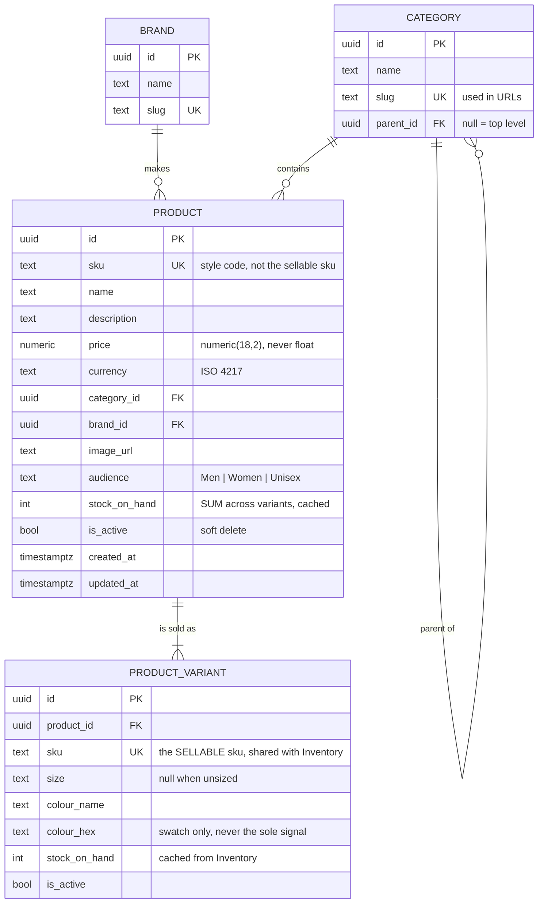

# Catalog service

> **Bounded context:** Catalog (supporting) · **Port:** 5001 · **Store:** PostgreSQL
> **Code:** [`src/services/catalog/ECommerce.Catalog.Api`](../../src/services/catalog/ECommerce.Catalog.Api/)
> **Related:** [Bounded contexts](../domain/bounded-contexts.md#catalog) · [ADR-0012 — CQRS](../adr/0012-cqrs-with-mediatr.md)

## Purpose

Owns everything *merchandising* means: products, variants-by-SKU, categories, brands, descriptions, images,
and **list prices**. It is the read-heavy front of the shop — browse traffic dwarfs every other service by
orders of magnitude.

### What it deliberately does not own

| Not owned | Owner | Why |
|-----------|-------|-----|
| Authoritative stock | Inventory | Stock changes on every order and delivery; product copy changes when marketing decides. Merging a high-churn contended write path into a read-optimised cached service would be the wrong trade. |
| The price actually paid | Ordering | An order records what the customer *agreed* to pay. A price change next week must not retroactively alter last week's order. |
| Whether an item can be bought now | Inventory (via the saga) | See the stock note below. |

### The stock question

`Product.StockOnHand` exists here but is a **cached, eventually-consistent display figure**, updated by
subscribing to Inventory's events (Phase 7).

**It is allowed to be wrong.** A product page showing "3 left" a few seconds stale is fine, because the
authoritative check happens when stock is *reserved* during checkout. The place you must be exactly right is
the reservation, not the browse page.

That is the whole lesson about choosing where eventual consistency is acceptable — same domain, both halves,
opposite answers.

---

## Domain model

Deliberately plain. Catalog is a **supporting** subdomain, so it gets entities with guarded constructors and
nothing more — no aggregate roots, no domain events, no four-layer split. Compare `Ordering`, the **core**
subdomain, which gets the full DDD treatment.



### Schema decisions worth defending

**`numeric(18,2)`, never `float`/`double`.** Binary floating point cannot represent `0.10` exactly, so money
in a double accumulates rounding error — the classic "totals are off by a penny" bug.

**`sku` is unique at the database**, not just in code. A uniqueness rule enforced only in application code is
one that two concurrent requests can both pass.

**`slug` drives URLs**, so `/products?category=t-shirts` is readable, shareable and bookmarkable. Exposing an
opaque GUID in a query string is a small usability tax paid on every link anyone shares.

**Soft delete (`is_active`)**, not `DELETE`. Historic orders reference this SKU and must stay meaningful.

**`snake_case` column names**, applied as a convention in `OnModelCreating` rather than per property. EF Core
defaults to the .NET property name, and PostgreSQL folds unquoted identifiers to lower case — so
`StockOnHand` would need quoting in every hand-written query, and a missing quote gives
`column p.stockonhand does not exist`.

---

## Products and variants

A **product** is a style: a name, a description, a price, a photograph, a category, a brand, and who it
is sold to. A **variant** is what a customer actually buys — a specific size and colour, with its own SKU
and its own stock. See [ADR-0020](../adr/0020-product-variants.md) for the argument and what it costs.

```
products                          product_variants
  id                                id
  sku          <- style code        product_id
  name                              sku        <- the SELLABLE sku, unique catalogue-wide
  price                             size       <- null when the product has no size axis
  audience     <- Men|Women|Unisex  colour_name / colour_hex
  stock_on_hand <- SUM of variants  stock_on_hand
```

**Two unique indexes, guaranteeing different things.** `products.sku` guarantees unique *styles*;
`product_variants.sku` guarantees unique *sellable units*. Reading only one of them leads to the wrong
conclusion, which is why both are named here.

**Every product has at least one variant**, including one with neither a size nor a colour. There is no
"simple product" path — a special case is a second code path that only the simple products exercise.

**`audience` is an attribute, not a branch of the category tree.** The taxonomy answers *what is this
thing*; audience answers *who is it for*. They vary independently, so they are two fields. Modelling
audience as a category means "T-shirts" exists twice, a unisex product must be duplicated to appear under
both, and adding "Kids" doubles the tree again. It is stored as the enum's **name**, so a row reads
`'Women'` in psql and survives someone reordering the members.

### Why this touched almost nothing downstream

SKU was already the integration key between Catalog, Inventory, Basket and Ordering — the one string that
crosses those boundaries. Moving it from the product to the variant meant:

| Service | Change needed |
|---|---|
| **Inventory** | **None.** `StockItem` keys on a SKU string; it has more rows and still does not know what a size is |
| **Basket** | Line identity moved from product id to SKU, plus two display fields |
| **Ordering** | Line merging moved from product id to SKU, plus two snapshot fields |

That is the payoff for having drawn the boundary at the SKU rather than at the product.

### Known gaps

- **Nothing validates that a variant SKU belongs to its product at checkout.** A forged SKU fails at stock
  reservation instead — the saga cancels the order and compensates — so it fails safe, but seconds later
  rather than immediately. Closing it means widening the Catalog pricing contract to return variants.
- **Facet counts are not filtered by the current selection.** "Navy (2)" is a count across the whole
  catalogue, not "Navy, given that you have already chosen Medium". Doing that properly needs a query per
  facet per request, which is the point at which a search index earns its keep.
- **Variants are read-only in the back office.** Sizes and colours are set by the seeder; the admin panel
  shows them with their stock but does not add or remove them.

---

## CQRS in practice

| | Write side | Read side |
|---|---|---|
| Technology | EF Core | **Dapper** |
| Goes through | domain entities | direct SQL |
| Returns | nothing | purpose-built DTOs |
| Tracked | yes | no |
| Code | `Domain/`, `Infrastructure/` | [`Features/Products/ProductQueries.cs`](../../src/services/catalog/ECommerce.Catalog.Api/Features/Products/ProductQueries.cs) |

**Why Dapper rather than `AsNoTracking()`.** `AsNoTracking()` removes the tracking cost but keeps you in the
entity's shape, which quietly invites navigation properties added *for reads* — and those corrupt the write
model. Hand-written SQL returning DTOs makes it structurally impossible for a query to touch a domain type.

**The honest cost:** this SQL is not refactoring-safe. Rename a column and nothing breaks until a test runs.
That is precisely why the read side needs integration tests against a real database rather than a mock.

### Query safety

Three things in the browse query that are easy to get wrong:

**`ORDER BY` uses an allow-list.** `ORDER BY` cannot be parameterised, so a caller-supplied sort field
concatenated into SQL is a direct injection route — one of the few places Dapper's parameterisation cannot
save you.

**Paging has an id tiebreaker.** Without `ORDER BY <col>, id`, two products sharing a sort value can swap
between page 1 and page 2 — so one is shown twice and another never.

**Category filtering includes children.** `?category=clothing` matches t-shirts and hoodies too. Without it a
top-level category looks empty, which reads as a bug.

---

## Endpoint reference

Base path `/api/catalog`. Reachable directly on `:5001`, or through the Storefront BFF on `:6001`.

### `GET /api/catalog/products`

Browse with search, filtering, sorting and paging.

**Auth:** anonymous. *A shop nobody can look at without an account is a shop nobody buys from.*

| Parameter | Type | Default | Notes |
|-----------|------|---------|-------|
| `search` | string | — | Case-insensitive across name, SKU and description |
| `category` | slug | — | Includes child categories |
| `brand` | slug | — | |
| `minPrice` / `maxPrice` | decimal | — | Inclusive |
| `inStockOnly` | bool | `false` | |
| `audience` | `Men` | `Women` | `Unisex` | — | An attribute, not a category |
| `size` | string | — | Matched against variants |
| `colour` | string | — | Matched against variants. With `size`, both must be on the **same** variant |
| `sortBy` | `name` \| `price` \| `brand` \| `newest` | `name` | Anything else falls back to `name` |
| `sortDescending` | bool | `false` | |
| `page` | int | `1` | Clamped to ≥ 1 |
| `pageSize` | int | `12` | **Clamped to 200** — unclamped is a DoS vector |

**200** — `PagedResult<ProductSummary>`:

```json
{
  "items": [{
    "id": "0198...", "sku": "NW-TS-001", "name": "Classic Cotton T-shirt",
    "price": 18.00, "currency": "GBP",
    "categoryName": "T-shirts", "categorySlug": "t-shirts",
    "brandName": "Northwind", "brandSlug": "northwind",
    "imageUrl": "/img/tshirt-classic.svg", "stockOnHand": 1600, "audience": "Men"
  }],
  "page": 1, "pageSize": 12, "totalCount": 12,
  "totalPages": 1, "hasPrevious": false, "hasNext": false
}
```

```bash
curl "http://localhost:5001/api/catalog/products?search=hoodie&sortBy=price&sortDescending=true"
```

---

### `GET /api/catalog/products/{id}`

**Auth:** anonymous · **200** `ProductDetail` · **404** `ProblemDetails`

Returns the product **and its variants**, in two result sets from one round trip. Variants are ordered
S/M/L/XL via `array_position` — alphabetical would put L before M before S before XL, which reads as a
bug on every product page in the shop.

```bash
curl "http://localhost:5001/api/catalog/products/{id}"
```

### `GET /api/catalog/facets`

**Auth:** anonymous · **200** `Facets` — audiences, sizes and colours with **product** counts.

One endpoint for all three rather than three, because a filter panel needs the whole set before it can
render anything. Counts are of products, not variants: "Navy (2)" has to mean two things you can click
through to.

### `GET /api/catalog/categories`

**Auth:** anonymous · **200** `CategoryDto[]` with `productCount`, ordered parents-first.

An empty category still appears, with a count of zero — hiding it would make the taxonomy the storefront
shows differ from the one the back office edits.

**`productCount` includes child categories, because filtering does.**

It used to count direct members only, and the result was a shopfront where every department advertised
*"Clothing — 0 products"* while clicking it returned six. Clothing holds no products itself; T-shirts and
Hoodies do. A count that disagrees with what selecting it returns is worse than no count at all.

The subquery mirrors the `category` filter's predicate exactly — *own category, or a direct child of it*:

```sql
(SELECT COUNT(*)::int
 FROM products p
 JOIN categories pc ON pc.id = p.category_id
 WHERE p.is_active = TRUE AND (pc.id = c.id OR pc.parent_id = c.id))
```

If one gains a level of nesting the other must too. They are two expressions of one rule, and the day they
disagree the shop lies about itself again.

**Rejected:** a recursive CTE, which would handle any depth. The taxonomy is deliberately two levels
([`docs/domain/bounded-contexts.md`](../domain/bounded-contexts.md)) and a recursive query that matches a
non-recursive filter is a different, quieter version of the same inconsistency.

### `GET /api/catalog/brands`

**Auth:** anonymous · **200** `BrandDto[]` with `productCount`.

### Admin endpoints

Staff only, and in a separate file from the public reads
([`ProductAdminEndpoints.cs`](../../src/services/catalog/ECommerce.Catalog.Api/Features/Products/ProductAdminEndpoints.cs))
so the entire write surface is visible at once.

| Endpoint | Permission | Notes |
|----------|-----------|-------|
| `POST /api/catalog/products` | `catalog:write` | |
| `PUT /api/catalog/products/{id}` | `catalog:write` | Name, description, image, category, brand |
| `PUT /api/catalog/products/{id}/price` | **`price:override`** | Separate on purpose — see below |
| `DELETE /api/catalog/products/{id}` | `catalog:delete` | **Does not delete** — see below |
| `POST /api/catalog/products/{id}/restore` | `catalog:delete` | Puts it back on sale |
| `GET /api/catalog/products/withdrawn` | `catalog:write` | Withdrawn products, invisible everywhere else |

#### Three permissions, not one

Editing a description, changing a price, and withdrawing an item are **different powers held by different
people**. A merchandiser writes copy; changing what customers are charged is the sort of thing an
organisation wants separately grantable and separately auditable.

That is why price is its own endpoint rather than a field on the update. Folding it in would mean anyone
who can fix a typo can reprice the shop — and the permission could not be checked on the route, which is
where the whole authorization surface is meant to be readable.

Verified: `catalogmgr` succeeds; `support` and `ordermgr` both get **403** on price.

#### `DELETE` does not delete

The route is `DELETE` and the row survives. That is not a compromise — it is the correct behaviour, and
the verb is kept because *withdrawing* is what "delete" means to the person clicking it.

Hard-deleting a product **breaks history**. Orders copy the product name and price onto their own lines
precisely so an old invoice still reads correctly, but:

- the `product_id` on those lines would dangle;
- the admin panel could not link from an order to what was bought;
- any report joining orders to products would **silently lose rows**.

So `is_active` goes false. The storefront stops showing it, checkout refuses it by name (*"'X' is not
currently available"*), and everything historical keeps working. Restoring is one call rather than a
database recovery.

Verified end to end: the storefront's search went from 1 result to 0, the row remained with
`is_active = f`, and restore put it back.

> Because every other query filters `is_active = TRUE`, withdrawing something would otherwise make it
> vanish from the only screen that could bring it back. Hence `GET /products/withdrawn`.

#### The SKU is immutable

Absent from both update requests, and disabled in both admin panels. It is what the warehouse picks by
and what historic order lines record, so renaming one silently decouples an order from the thing that was
shipped. Withdraw and create a new one instead.

#### Duplicate SKUs

Checked in code **and** enforced by a unique index. The check alone loses a race between two concurrent
creates; the index alone produces a 500 with `23505: duplicate key value violates unique constraint` in
the body. Both together give a merchandiser a sentence they can act on:

```json
{
  "title": "The request was refused",
  "status": 400,
  "detail": "SKU 'NW-TS-001' is already in use.",
  "correlationId": "019faec2-8dbf-7672-aba0-ee4efc47b02e"
}
```

That translation is not local to this service — see
[`DomainExceptionHandler`](../../src/building-blocks/Observability/DomainExceptionHandler.cs), applied by
`AddObservability` so every service behaves the same way.

---

## Events


| Direction | Event | Phase |
|-----------|-------|-------|
| Publishes | `ProductPriceChanged` → Basket updates and **flags** affected lines | 6 |
| Consumes | `StockLevelChanged` from Inventory → updates the cached figure | 7 |

See the [event catalogue](../events/event-catalogue.md).

---

## Configuration

| Key | Purpose |
|-----|---------|
| `ConnectionStrings:CatalogDb` | PostgreSQL |
| `Auth:Issuer` / `Auth:MetadataAddress` / `Auth:Audience` | Token validation |
| `Cors:Origins` | Direct browser access when debugging without the BFF |
| `SeedDemoData` | Seed on startup (default `true`) |

## Health

| Endpoint | Checks |
|----------|--------|
| `/health/live` | Self only — a database blip must never trigger a restart |
| `/health/ready` | PostgreSQL |

## Migrations

```bash
dotnet tool run dotnet-ef migrations add <Name> \
  --project src/services/catalog/ECommerce.Catalog.Api \
  --output-dir Infrastructure/Migrations
```

Applied automatically on startup by
[`CatalogSeeder`](../../src/services/catalog/ECommerce.Catalog.Api/Infrastructure/CatalogSeeder.cs), which
also seeds 12 products, 6 categories and 3 brands so `docker compose up` produces a browsable shop.

> **Simplified for this repo.** Production would not migrate from application startup — several replicas
> would race, and a failed migration would crash every instance rather than one deployment step. See
> [deployment](../operations/deployment.md).

Design-time tooling uses
[`CatalogDbContextFactory`](../../src/services/catalog/ECommerce.Catalog.Api/Infrastructure/CatalogDbContextFactory.cs),
because `dotnet ef` otherwise tries to build the host and fails on the missing connection string.

## Seed data

12 products and **49 variants** across 6 categories and 3 brands, with stock deliberately spread so every
state the UI can render is reachable without editing the database:

| State | Where |
|---|---|
| In stock in every size | `NW-TS-001`, `NW-HD-001` |
| **Low in one size, fine in the others** | `CT-TS-003` — 2 left in Black S |
| One size sold out while the product is not | `CT-TS-003` — Black XL is empty, Ecru XL has one |
| Low in TOTAL, so the product *card* says so | `CT-HD-002` — 2 altogether |
| Sold out entirely | `FB-HD-003`, `CT-ST-002` |
| Colours but no sizes | all drinkware |
| Neither axis — one variant, no pickers | all stationery |

One product is priced at £5,200 — above the payment simulator's decline threshold — so the saga's
compensation path can be demonstrated on demand.

**Products the e2e suite buys hold 200 of every variant.** A paid order keeps its stock reservation until
it ships and nothing here ships automatically, so every run permanently consumes stock; a realistic figure
on a spec-bought SKU drains within a day and the saga specs then fail with a perfectly correct "Out of
stock". These figures are mirrored exactly in `InventorySeeder`, and the two lists must be changed
together — duplicated across the service boundary on purpose, because a shared seed library would couple
two services that are supposed to own their own data.
