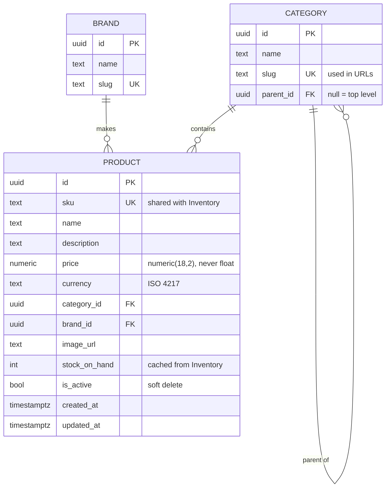

# Catalog service

> **Bounded context:** Catalog (supporting) · **Port:** 5001 · **Store:** PostgreSQL
> **Code:** [`src/services/catalog/ECommerce.Catalog.Api`](../../src/services/catalog/ECommerce.Catalog.Api/)
> **Related:** [Bounded contexts](../domain/bounded-contexts.md#catalog) · [ADR-0012 — CQRS](../adr/0012-cqrs-with-mediatr.md)

## Purpose

Owns everything *merchandising* means: products, variants-by-SKU, categories, brands, descriptions, images,
and **list prices**. It is the read-heavy front of the shop — browse traffic dwarfs every other service by
orders of magnitude.

### What it deliberately does not own

| Not owned | Owner | Why |
|-----------|-------|-----|
| Authoritative stock | Inventory | Stock changes on every order and delivery; product copy changes when marketing decides. Merging a high-churn contended write path into a read-optimised cached service would be the wrong trade. |
| The price actually paid | Ordering | An order records what the customer *agreed* to pay. A price change next week must not retroactively alter last week's order. |
| Whether an item can be bought now | Inventory (via the saga) | See the stock note below. |

### The stock question

`Product.StockOnHand` exists here but is a **cached, eventually-consistent display figure**, updated by
subscribing to Inventory's events (Phase 7).

**It is allowed to be wrong.** A product page showing "3 left" a few seconds stale is fine, because the
authoritative check happens when stock is *reserved* during checkout. The place you must be exactly right is
the reservation, not the browse page.

That is the whole lesson about choosing where eventual consistency is acceptable — same domain, both halves,
opposite answers.

---

## Domain model

Deliberately plain. Catalog is a **supporting** subdomain, so it gets entities with guarded constructors and
nothing more — no aggregate roots, no domain events, no four-layer split. Compare `Ordering`, the **core**
subdomain, which gets the full DDD treatment.



### Schema decisions worth defending

**`numeric(18,2)`, never `float`/`double`.** Binary floating point cannot represent `0.10` exactly, so money
in a double accumulates rounding error — the classic "totals are off by a penny" bug.

**`sku` is unique at the database**, not just in code. A uniqueness rule enforced only in application code is
one that two concurrent requests can both pass.

**`slug` drives URLs**, so `/products?category=t-shirts` is readable, shareable and bookmarkable. Exposing an
opaque GUID in a query string is a small usability tax paid on every link anyone shares.

**Soft delete (`is_active`)**, not `DELETE`. Historic orders reference this SKU and must stay meaningful.

**`snake_case` column names**, applied as a convention in `OnModelCreating` rather than per property. EF Core
defaults to the .NET property name, and PostgreSQL folds unquoted identifiers to lower case — so
`StockOnHand` would need quoting in every hand-written query, and a missing quote gives
`column p.stockonhand does not exist`.

---

## CQRS in practice

| | Write side | Read side |
|---|---|---|
| Technology | EF Core | **Dapper** |
| Goes through | domain entities | direct SQL |
| Returns | nothing | purpose-built DTOs |
| Tracked | yes | no |
| Code | `Domain/`, `Infrastructure/` | [`Features/Products/ProductQueries.cs`](../../src/services/catalog/ECommerce.Catalog.Api/Features/Products/ProductQueries.cs) |

**Why Dapper rather than `AsNoTracking()`.** `AsNoTracking()` removes the tracking cost but keeps you in the
entity's shape, which quietly invites navigation properties added *for reads* — and those corrupt the write
model. Hand-written SQL returning DTOs makes it structurally impossible for a query to touch a domain type.

**The honest cost:** this SQL is not refactoring-safe. Rename a column and nothing breaks until a test runs.
That is precisely why the read side needs integration tests against a real database rather than a mock.

### Query safety

Three things in the browse query that are easy to get wrong:

**`ORDER BY` uses an allow-list.** `ORDER BY` cannot be parameterised, so a caller-supplied sort field
concatenated into SQL is a direct injection route — one of the few places Dapper's parameterisation cannot
save you.

**Paging has an id tiebreaker.** Without `ORDER BY <col>, id`, two products sharing a sort value can swap
between page 1 and page 2 — so one is shown twice and another never.

**Category filtering includes children.** `?category=clothing` matches t-shirts and hoodies too. Without it a
top-level category looks empty, which reads as a bug.

---

## Endpoint reference

Base path `/api/catalog`. Reachable directly on `:5001`, or through the Storefront BFF on `:6001`.

### `GET /api/catalog/products`

Browse with search, filtering, sorting and paging.

**Auth:** anonymous. *A shop nobody can look at without an account is a shop nobody buys from.*

| Parameter | Type | Default | Notes |
|-----------|------|---------|-------|
| `search` | string | — | Case-insensitive across name, SKU and description |
| `category` | slug | — | Includes child categories |
| `brand` | slug | — | |
| `minPrice` / `maxPrice` | decimal | — | Inclusive |
| `inStockOnly` | bool | `false` | |
| `sortBy` | `name` \| `price` \| `brand` \| `newest` | `name` | Anything else falls back to `name` |
| `sortDescending` | bool | `false` | |
| `page` | int | `1` | Clamped to ≥ 1 |
| `pageSize` | int | `12` | **Clamped to 200** — unclamped is a DoS vector |

**200** — `PagedResult<ProductSummary>`:

```json
{
  "items": [{
    "id": "0198...", "sku": "NW-TS-001", "name": "Classic Cotton T-shirt",
    "price": 18.00, "currency": "GBP",
    "categoryName": "T-shirts", "categorySlug": "t-shirts",
    "brandName": "Northwind", "brandSlug": "northwind",
    "imageUrl": "/img/tshirt-classic.svg", "stockOnHand": 42
  }],
  "page": 1, "pageSize": 12, "totalCount": 12,
  "totalPages": 1, "hasPrevious": false, "hasNext": false
}
```

```bash
curl "http://localhost:5001/api/catalog/products?search=hoodie&sortBy=price&sortDescending=true"
```

### `GET /api/catalog/products/{id}`

**Auth:** anonymous · **200** `ProductDetail` (adds `description`) · **404** `ProblemDetails`

```bash
curl "http://localhost:5001/api/catalog/products/{id}"
```

### `GET /api/catalog/categories`

**Auth:** anonymous · **200** `CategoryDto[]` with `productCount`, ordered parents-first.

Uses a `LEFT JOIN` so an empty category still appears with a count of zero — an `INNER JOIN` would make it
vanish from the filter list, which looks like a bug.

### `GET /api/catalog/brands`

**Auth:** anonymous · **200** `BrandDto[]` with `productCount`.

### Coming in Phase 9 (admin)

| Endpoint | Permission |
|----------|-----------|
| `POST /api/catalog/products` | `catalog:write` |
| `PUT /api/catalog/products/{id}` | `catalog:write` |
| `DELETE /api/catalog/products/{id}` | `catalog:delete` |
| `PUT /api/catalog/products/{id}/price` | `price:override` |

---

## Events

| Direction | Event | Phase |
|-----------|-------|-------|
| Publishes | `ProductPriceChanged` → Basket updates and **flags** affected lines | 6 |
| Consumes | `StockLevelChanged` from Inventory → updates the cached figure | 7 |

See the [event catalogue](../events/event-catalogue.md).

---

## Configuration

| Key | Purpose |
|-----|---------|
| `ConnectionStrings:CatalogDb` | PostgreSQL |
| `Auth:Issuer` / `Auth:MetadataAddress` / `Auth:Audience` | Token validation |
| `Cors:Origins` | Direct browser access when debugging without the BFF |
| `SeedDemoData` | Seed on startup (default `true`) |

## Health

| Endpoint | Checks |
|----------|--------|
| `/health/live` | Self only — a database blip must never trigger a restart |
| `/health/ready` | PostgreSQL |

## Migrations

```bash
dotnet tool run dotnet-ef migrations add <Name> \
  --project src/services/catalog/ECommerce.Catalog.Api \
  --output-dir Infrastructure/Migrations
```

Applied automatically on startup by
[`CatalogSeeder`](../../src/services/catalog/ECommerce.Catalog.Api/Infrastructure/CatalogSeeder.cs), which
also seeds 12 products, 6 categories and 3 brands so `docker compose up` produces a browsable shop.

> **Simplified for this repo.** Production would not migrate from application startup — several replicas
> would race, and a failed migration would crash every instance rather than one deployment step. See
> [deployment](../operations/deployment.md).

Design-time tooling uses
[`CatalogDbContextFactory`](../../src/services/catalog/ECommerce.Catalog.Api/Infrastructure/CatalogDbContextFactory.cs),
because `dotnet ef` otherwise tries to build the host and fails on the missing connection string.

## Seed data

12 products across 6 categories and 3 brands, with stock deliberately spread so **in-stock, low-stock and
out-of-stock states are all reachable** without editing the database. One product is priced at £5,200 — above
the payment simulator's decline threshold — so the saga's compensation path can be demonstrated on demand.
