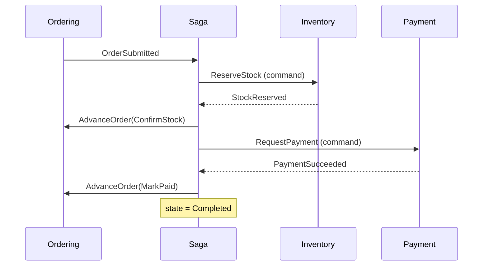
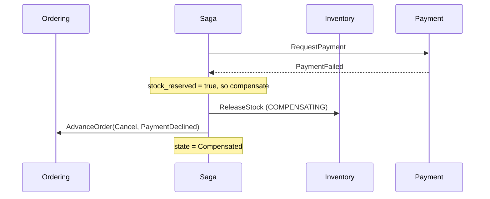

# Ordering saga

> **Kind:** Process orchestrator · **Port:** 5009 · **Store:** PostgreSQL
> **Code:** [`src/services/ordering-saga/`](../../src/services/ordering-saga/)
> **Related:** [Ordering](ordering.md) · [Inventory](inventory.md) · [Payment](payment.md) ·
> [concepts-explained.md](../concepts-explained.md)

## What a saga is, in plain English

A **saga** is how you get a multi-step process to behave sensibly when each step happens in a different
service with a different database.

Inside one database you would use a transaction: do all four things, and if the fourth fails, undo the
first three automatically. Across four databases there is no such thing. Each service has already
committed by the time the next one fails.

So instead of *undoing*, you **do something new that has the opposite effect**. That is a
**compensating action**. Stock was reserved and payment failed? Release the stock. Money was taken and
delivery is impossible? Refund it.

The saga is the thing that remembers which steps happened and issues those compensations.

---

## 1. The two ways to build one, and why this repo chose orchestration

### Choreography

Each service listens for the previous one's event and reacts. Inventory hears `OrderSubmitted`, Payment
hears `StockReserved`, and so on. Nobody is in charge.

**It is genuinely elegant for two or three steps.** No coordinator, no single point of failure, and each
service stays ignorant of the others.

It stops being elegant the moment somebody asks:

> **"Where is order 12345 stuck?"**

The answer is spread across four services' logs and exists **nowhere as a single fact**. Worse, to
compensate a failed payment you need to know whether stock was reserved — and no individual service
holds that knowledge.

### Orchestration

One service owns the process. It sends commands, listens for outcomes, and decides what happens next —
including what to undo.

**This repo uses orchestration**, and the reason is the query above. One row per order says which step it
is on, when each completed, and what compensation ran:

```sql
SELECT order_number, state, stock_reserved FROM order_sagas WHERE completed_at IS NULL;
```

The cost is real and worth naming: a service that knows about all the others. That is coupling. It is
accepted deliberately, because it is **confined to one place** rather than smeared across four — and
because the alternative makes the most important operational question unanswerable.

---

## 2. The flow

### Happy path



Verified against the running stack:

```
- OrderSubmitted          : 1 line(s), 29.00 GBP
- ReserveStockRequested   : Asked Inventory to reserve stock.
- StockReserved           : 1 line(s) reserved.
- PaymentRequested        : Requested 29.00 GBP.
- PaymentSucceeded        : Reference pay_019f9f60b9d27908.
- SagaCompleted           : Order paid; checkout complete.
```

### Compensation



Verified, ordering the £5,200 item. Stock went `reserved=0 → 1 → 0` across the run:

```
- StockReserved             : 1 line(s) reserved.
- PaymentRequested          : Requested 5200.00 GBP.
- PaymentFailed             : Declined: amount exceeds the 5000 GBP limit.
- CompensatingReleaseStock  : Releasing reserved stock.
- SagaCompensated           : Order cancelled and stock returned.
```

The order ended `Cancelled` with reason `PaymentDeclined`, and the customer received an email saying so.

### Out of stock — no compensation

```
StockRejected ──► Cancel(OutOfStock)
```

**No `ReleaseStockCommand`, and that is the point.** Nothing was reserved, so releasing would *add*
stock that never left — a corruption in the opposite direction from the failure, and one nobody notices
until a stock take disagrees with the system.

---

## 3. A compensating action is not a rollback

Treating them as the same thing causes bugs. The differences matter:

| Rollback | Compensating action |
|----------|--------------------|
| Cannot fail | **Can fail**, and then needs retrying |
| Instantaneous | Happens **later** — the world has moved on |
| Leaves no trace | Is a **real event** others can see |
| Restores the exact prior state | Achieves a *similar* state |

That third row is why `StockReleased` is published: a compensation that leaves no trace is
indistinguishable from nothing having happened.

The fourth is the honest one. Released stock **may have been sold to someone else** in the meantime. You
cannot rewind the world; you can only do something that makes it approximately right again.

### The three properties every compensating action needs

1. **Idempotent.** It will be retried. `StockItem.Release` clamps at zero for exactly this reason.
2. **Safe when the step never happened.** Guarded by the saga's own `stock_reserved` flag.
3. **Semantically honest.** It does not claim to have undone anything — it did something new.

---

## 4. Why every handler is idempotent

Delivery is **at-least-once**. These messages *will* arrive twice — the publisher can crash after the
broker accepts a message but before recording success; a consumer can crash after doing the work but
before acknowledging. None of this is exotic; it is ordinary Tuesday.

Each handler guards the same way: load the saga, check its state, return quietly if there is nothing to
do.

```csharp
if (saga is null || saga.IsFinished) return;
```

**The order id is the saga's primary key**, so a duplicate `OrderSubmitted` hits the unique constraint
rather than starting a second saga that reserves the stock again.

> Note the belt and braces: `PaymentSucceededHandler` returns early *and* `Order.MarkAsPaid` is
> idempotent. Two services each relying on the other to catch duplicates is how a duplicate gets
> through.

---

## 5. Commands are not events

| Event | Command |
|-------|---------|
| "This happened" — past tense | "Do this" — imperative |
| Broadcast; zero or many listeners | Addressed to exactly one service |
| Publisher does not care who reacts | Sender expects an outcome and waits for it |
| Cannot be rejected — it already happened | **Can fail**, and the failure is meaningful |

The saga sends `ReserveStockCommand` and `RequestPaymentCommand`; it receives `StockReserved` and
`PaymentFailed`. Blurring the two produces services that publish "OrderShouldBePaid" and consumers
unsure whether they are allowed to say no.

Both travel over the same RabbitMQ exchange and use the same `IntegrationEvent` base class. The
distinction is **semantic, not technical** — and it is worth keeping precisely because nothing enforces
it.

---

## 6. The saga uses the outbox too

Every command the saga sends is written to its own outbox, **in the same transaction as the state change
that decided to send it**.

Without that, a crash between "record that we asked for stock" and "actually ask" leaves a saga waiting
forever for a reply to a question nobody heard — and, because the saga's own record says it asked, no
retry would ever happen. The outbox is what makes the saga's state and its outgoing messages agree.

---

## 7. The saga decides *when*; the aggregate decides *whether*

The saga sequences transitions. It knows nothing about what makes one legal:

```csharp
outbox.Add(new AdvanceOrderCommand { OrderId = …, Transition = "MarkPaid" });
```

Ordering's handler calls `Order.MarkAsPaid`, and the **aggregate** refuses if the order is not awaiting
payment. The saga cannot talk an order into an illegal state.

The alternative — an orchestrator that sets the status directly — puts the rules in two places and lets
the saga produce states the aggregate would never allow. **Sagas are hard enough without the
participants being unable to defend themselves.**

---

## 8. Endpoints

Read-only, deliberately. **There is no endpoint that changes a saga**: it advances only in response to
what really happened, and an endpoint that let someone push it forward by hand would let its record
disagree with reality — the one thing it exists to prevent.

| Method | Route | Permission | Purpose |
|--------|-------|-----------|---------|
| `GET` | `/api/saga/orders/{orderId}` | `order:read` or `order:read:own` | The timeline for one order |
| `GET` | `/api/saga/stuck?olderThanMinutes=5` | `order:read` | Sagas that started and never finished |

The second is the operational payoff. In a choreographed design that query **cannot be written**.

---

## 9. Schema

| Table | Holds |
|-------|-------|
| `order_sagas` | One row per order: state, `stock_reserved`, failure reason, timings |
| `saga_steps` | Append-only log, ordered by `sequence` |
| `outbox_messages`, `processed_messages` | The saga's own outbox |

**`stock_reserved` is the single most important column.** It is what stops the saga issuing a release for
a reservation that never happened.

**`saga_steps.sequence`, not just `occurred_at`.** Two steps recorded in the same millisecond come back
in an arbitrary order otherwise, and a timeline showing compensation *before* the failure it compensates
is worse than no timeline.

---

## 10. What a production system would add

Named rather than left as gaps a reader has to notice:

**Timeouts.** If Inventory never replies, this saga waits forever. Production needs a scheduled check
that finds sagas stuck past a threshold and compensates them. The `/stuck` endpoint is the query that
would drive it; the scheduler is not built.

**A retry budget.** A compensating action that keeps failing needs to stop and raise an alert rather than
retry indefinitely.

**Refund on a later failure.** `RefundPaymentCommand` and its handler exist but are never sent, because
payment is currently the last step that can fail. They are written so that adding a shipping-label step
tomorrow has a complete compensation story rather than an aspirational one.
