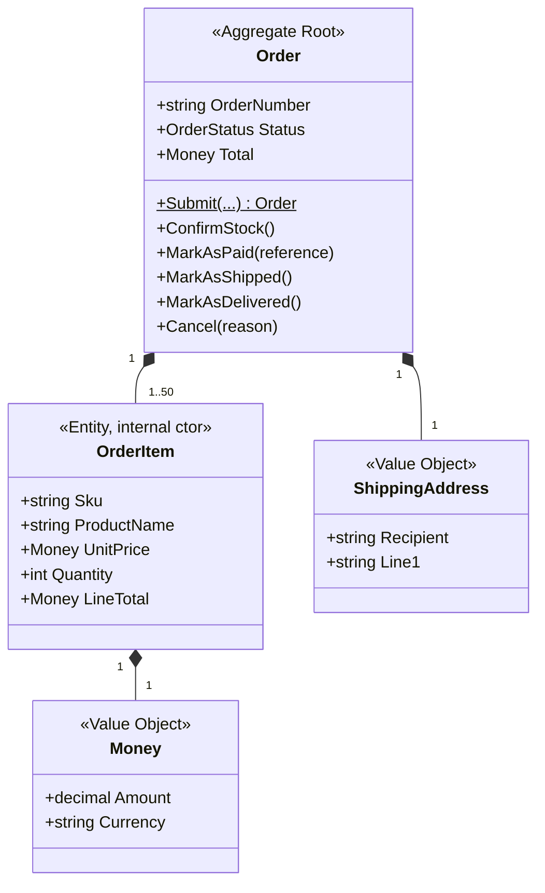

# Ordering service

> **Bounded context:** Ordering (**core**) · **Port:** 5003 · **Store:** PostgreSQL
> **Code:** [`src/services/ordering/`](../../src/services/ordering/)
> **Related:** [Basket](basket.md) · [Transactional outbox](#the-transactional-outbox) ·
> [ADR-0012 — CQRS](../adr/0012-cqrs-with-mediatr.md)

## Purpose

Turning a basket into an order, and moving that order through its life: submitted → stock confirmed →
paid → shipped → delivered, or cancelled along the way.

This is the **core subdomain** — the part that makes this a shop rather than a database — and it is the
one place in the repo where full DDD earns its keep.

---

## 1. Why this service gets the full treatment and others do not

| Service | Shape | Why |
|---------|-------|-----|
| Catalog | One project, light model | Supporting. Mostly CRUD over product data. |
| Basket | One project, plain class | Supporting. Almost no rules — see [basket.md](basket.md). |
| **Ordering** | **Four projects, rich aggregate** | **Core.** The rules here are the business. |

The four projects are `Api → Application → Domain`, with `Infrastructure` implementing the interfaces the
application declares. The dependency arrow points **inwards**: `Domain` references nothing but the
seed-work base classes, which is enforced by a test in
[`ECommerce.Architecture.Tests`](../../tests/unit/ECommerce.Architecture.Tests/).

The practical payoff: **26 tests covering every business rule run in 177ms with no database, no host and
no mocks**, directly against the aggregate. That is only possible because the domain has no infrastructure
in it.

---

## 2. The Order aggregate



### The boundary is enforced by the compiler

Nothing outside can reach an `OrderItem`:

- its constructor and mutators are **`internal`**
- the collection is exposed as `IReadOnlyCollection`
- there is **no repository** for a line, and no way to load one on its own

That is not ceremony. It is the only way *"the total equals the sum of the lines"* can be a **guarantee**
rather than a convention. A second entry point — an admin tool, a CSV import, a data-fix script — goes
through the same methods and obeys the same rules. Validation written in an HTTP handler protects exactly
one caller.

### The total is derived, never stored

```csharp
public Money Total => _items.Aggregate(Money.Zero(Currency), (running, item) => running.Add(item.LineTotal));
```

A stored total is a second source of truth for the same fact, and the two drift the first time a line is
edited by a path that forgets to recalculate. Deriving it makes the inconsistency **unrepresentable**.

(If a report needed to filter on it at scale, the read model — not the aggregate — is where a denormalised
copy belongs.)

### `Money` carries its currency

A bare `decimal` for a price is the most common modelling mistake in a shopping system, and it fails
silently: nothing stops you adding pounds to euros, and the result looks entirely plausible. Making
currency part of the type turns that into an **exception at the point of the mistake** instead of a wrong
number on an invoice.

`decimal`, not `double`, because binary floating point cannot represent 0.1 exactly — summing ten items at
0.10 gives 0.9999999999999999, and a total that is a penny out once in a thousand orders is a support
ticket nobody can reproduce. Rounded on construction with `MidpointRounding.ToEven` (banker's rounding),
which is the accountancy default because always rounding .5 up introduces a systematic upward bias.

### The address and the product details are **copied**

An order stores its own snapshot of the shipping address, the product name and the unit price.

If it held foreign keys instead, a customer moving house next year would silently rewrite where last
year's parcel was sent, and a sale would retroactively reprice every historical order. **An order is a
record of something that happened, and history does not get to change because a profile or a price list
did.**

The storefront says so on the order page: *"Recorded as it was when you ordered, so changing your address
book will not alter this."*

---

## 3. The state machine

```
  Submitted ──► AwaitingPayment ──► Paid ──► Shipped ──► Delivered
      │                │              │
      └────────────────┴──────────────┴──────────► Cancelled
```

Each transition is a method that checks the current state first. The alternative — `IsPaid`,
`IsCancelled`, `IsShipped` booleans and callers who remember to check them — permits *"cancelled and
shipped"* to be true at once, and something eventually produces it.

**Cancellation is legal up to and including `Paid`**, because a paid order that has not left the building
can still be stopped and refunded. Once `Shipped` it is refused, with a message that names the right
process:

> Order ORD-… has already been dispatched and cannot be cancelled. Raise a return instead.

Not a generic "invalid state" error, because the caller's next step is genuinely different — a
cancellation and a return move different money and different stock.

### Idempotency is designed in, not bolted on

```csharp
public void MarkAsPaid(string paymentReference)
{
    if (Status == OrderStatus.Paid) return;   // <- the whole point
    ...
}
```

RabbitMQ delivers **at least once**, so a payment confirmation *will* arrive twice eventually. Throwing
would dead-letter a message describing something already true; raising a second event would email the
customer twice. `Cancel` is idempotent for the same reason, and keeps the **first** reason — a compensating
retry must not rewrite why something happened.

### Cancellation records whether there was stock to release

```csharp
RaiseDomainEvent(new OrderCancelledDomainEvent(..., stockWasReserved));
```

The saga needs this to know whether to compensate. **Releasing stock that was never reserved inflates the
available count** — a corruption in the opposite direction from the one being fixed, and harder to notice.

---

## 4. The transactional outbox

The pattern this phase exists to demonstrate. Implemented once, in
[`src/building-blocks/Outbox`](../../src/building-blocks/Outbox/), and reused by Payment and Inventory in
Phase 7.

### The problem

A service that changes its database and then publishes a message is doing two things that fail
independently:

```csharp
await db.SaveChangesAsync();      // committed
await bus.PublishAsync(@event);   // ...and the process dies here
```

The order exists and **nobody was told**. No stock reserved, no payment taken, no email sent, and nothing
in the system aware anything is wrong. Swap the two lines and you get the worse bug: other services react
to an order that was never saved.

### Why not a distributed transaction

Two-phase commit across PostgreSQL and RabbitMQ needs XA support on both, holds locks for the duration of
a network round trip, and blocks indefinitely if the coordinator dies at the wrong moment. It converts an
availability problem into a distributed-locking problem — which is why microservice architectures almost
universally do not use it.

### The outbox

Write the event into a table **in the same database**, in the **same transaction** as the order. One
database, one commit, no coordination protocol.

```
BEGIN
  INSERT INTO orders ...
  INSERT INTO outbox_messages ...    -- atomic together
COMMIT
                                     -- separately, later:
publisher: SELECT unpublished -> RabbitMQ -> mark published
```

In code, the crucial detail is that `IOutboxWriter.Add` **does not save**:

```csharp
orders.Add(order);
outbox.Add(new OrderSubmittedIntegrationEvent(...));
await unitOfWork.SaveChangesAsync();   // ONE commit: both rows, or neither
```

A `SaveChangesAsync` inside the writer would quietly destroy the whole pattern by creating a second,
separate transaction.

### What it costs

| Gain | Cost |
|------|------|
| Atomicity without 2PC | Publication is **asynchronous** — consumers see the event a moment later |
| Nothing is ever lost | Delivery is **at-least-once** — every consumer must be idempotent |

Exactly-once delivery across a network is not achievable, so at-least-once is not a flaw to engineer away.
[`ProcessedMessage`](../../src/building-blocks/Outbox/ProcessedMessage.cs) provides the receiving half for
handlers whose work is not naturally idempotent.

### Implementation details worth defending

| Decision | Why |
|----------|-----|
| **The event's own id is the row's primary key** | The same value travels to the broker, so a consumer can recognise a duplicate. A fresh key here would break that chain. |
| **Payload stored as `jsonb`** | The first thing anybody does with a failed message is read it. `SELECT payload FROM outbox_messages` being readable is worth more than the bytes it saves. |
| **Partial index `WHERE published_at IS NULL`** | The publisher's only query is "unpublished, oldest first", running every second forever. The index holds only pending rows, so it stays tiny even when the table has millions of published ones. |
| **Event names resolve through a registry** | Not an assembly-qualified type name, which would tie every stored row to a namespace *and* be a deserialisation gadget. Only registered types can be constructed. |
| **Failures are recorded, not rethrown** | One poisonous message must not stop the other 49 in the batch. `attempts` and `last_error` make it visible. |
| **The loop never dies** | A publisher that exits on the first transient database error stops every integration event in the service, silently, until someone restarts it. |

### The bug that proved the pattern's worth

The writer serialised with `JsonSerializerDefaults.Web` (camelCase) and the publisher deserialised with
the library defaults (PascalCase, case-sensitive). Every event committed correctly and then failed to
publish.

The failure mode is worth dwelling on: the writer is on the request path and the publisher is a background
loop, so **nothing the customer did returned an error**. Orders were created perfectly and no other
service ever heard about them. It was visible only as rows with a rising `attempts` count.

```
           event_name           | attempts | published
--------------------------------+----------+-----------
 OrderSubmittedIntegrationEvent |      301 | f
```

Then, the moment the bug was fixed:

```
 OrderSubmittedIntegrationEvent |      301 | t
```

**Nothing was lost across hundreds of failed attempts.** A direct publish would have dropped both events
silently and nobody would ever have known. Both halves now share
[one `JsonSerializerOptions`](../../src/building-blocks/Outbox/OutboxSerialization.cs).

---

## 5. Placing an order

[`PlaceOrderHandler`](../../src/services/ordering/ECommerce.Ordering.Application/Orders/PlaceOrderHandler.cs)
shows what an application layer is actually for: **orchestration, and nothing else.**

1. Read the basket (synchronous call to Basket). No basket, no order.
2. **Re-price every line from Catalog.** ← the security step
3. Ask the aggregate to build the order — every invariant applies here, in one place.
4. Write the order **and** the integration event in **one** transaction.
5. Clear the basket afterwards, outside the transaction, tolerating failure.

Note what the handler does *not* do: it never checks the total, the line count or the currency. Those are
the aggregate's job, and duplicating them here is how two versions of a rule start to disagree.

### Re-pricing

The price in a basket came from a client, over the network, and may have sat there for a month. Trusting
it at checkout means:

- anyone who can send an HTTP request sets their own prices;
- a legitimate customer is charged last month's price after a rise;
- a product withdrawn from sale can still be bought.

So every line is re-priced from Catalog at the moment the order is placed, and the product **name** comes
from Catalog too — a renamed product shows its real name on the invoice rather than whatever the client
sent.

A price that has *moved* is logged, not rejected: that is normal, and blocking the order would be worse
for everyone. A product that no longer exists or is withdrawn **is** rejected, naming the item so the
customer knows which one to remove.

There is deliberately **no fallback** if Catalog is unreachable. Falling back to the basket's own prices
would reintroduce the exact vulnerability this call exists to close. An error the customer can retry is
better than a silent discount.

### Clearing the basket is not part of the transaction

It cannot be — different service, different database. If it fails, the order still exists and is correct;
the customer merely sees stale items, which is an annoyance rather than a lost order. Letting that failure
roll back a committed, paid-for order would be strictly worse.

> A production system would make this a compensating step in the saga rather than fire-and-forget. Naming
> that as a known limitation is more honest than a silent `catch`.

---

## 6. CQRS

**A boundary, not a naming convention.**

| Side | Technology | Returns |
|------|-----------|---------|
| Write | EF Core + the aggregate | Nothing — commands mutate |
| Read | **Dapper**, hand-written SQL | Purpose-built DTOs |

[`OrderQueries`](../../src/services/ordering/ECommerce.Ordering.Application/Orders/OrderQueries.cs) holds
an `IDbConnection`, **not** a `DbContext`. It has no way to reach a domain type even by accident.

### Why bother

The two sides genuinely want different things. A write needs the whole aggregate loaded so its invariants
can be checked. A read of "my orders" needs a reference, a date, a status and a total for twenty rows —
and materialising twenty aggregates with every line, to display none of them, is an order of magnitude
more work and more data than the screen uses.

### What it costs

Hand-written SQL is **not refactor-safe**: rename a column and the compiler says nothing. That is a real
cost, paid deliberately, and the reason integration tests run against a real PostgreSQL — a typo here can
only be caught by executing it.

Two bugs from this phase make the point concretely:

**PostgreSQL folds unquoted identifiers to lowercase.** EF's default `"Id"` column is invisible to
`SELECT o.id`. EF quotes everything it generates, so the *write* side was perfectly happy and only the
query failed — at runtime, with `column o.id does not exist`. Every key column is now named explicitly.

**Dapper matches column names exactly and does not translate `snake_case`.** The unaliased order query
silently left every property at its default, producing an order with no reference and a total of **zero**.
A wrong *value* rather than an error, which is far harder to notice than an exception. Every column is
aliased now.

---

## 7. Endpoint reference

| Method | Route | Permission | Notes |
|--------|-------|-----------|-------|
| `POST` | `/api/orders` | `order:write` | Turns the caller's basket into an order |
| `GET` | `/api/orders/me` | `order:read` **or** `order:read:own` | Always filtered to the caller's `sub` |
| `GET` | `/api/orders/{id}` | `order:read` **or** `order:read:own` | Customers see their own; staff see any |
| `POST` | `/api/orders/{id}/cancel` | `order:cancel` **or** `order:read:own` | Ownership checked in the handler |
| `POST` | `/api/orders/{id}/confirm-stock` | `inventory:adjust` | Staff. Phase 7 drives this from the saga. |
| `POST` | `/api/orders/{id}/pay` | `order:write` | Staff. Phase 7 replaces this with the payment saga. |
| `POST` | `/api/orders/{id}/ship` | `order:cancel` | Staff |
| `POST` | `/api/orders/{id}/deliver` | `order:cancel` | Staff |

### Two kinds of authorization

The **permission** answers *"may this kind of user do this kind of thing"*. **Ownership** answers *"to
whose order"* — and that cannot be checked until the order is loaded, so it happens in the handler and in
the query's `WHERE` clause.

Both are needed. `order:read:own` without an ownership check would let any customer read any order.

**Either permission opens the door on reads.** Requiring only `:own` returned 403 to every member of
staff, because reading *any* order and reading *your own* order are deliberately different permissions.
`/orders/me` is always filtered to the caller's `sub` server-side, so someone holding `order:read` can
self-evidently read their own.

### 404, not 403, for someone else's order

Distinguishing the two confirms to an attacker that the id is real, which is what makes enumeration worth
attempting. The filter is applied in the SQL `WHERE` clause rather than checked after loading, so another
customer's order is never in memory to be leaked by a logging statement.

### Verified

```
customer reads own order:     200
support reads any order:      200
support cancels (read-only!): 403
anonymous reads order:        401
```

---

## 8. Integration events

Published through the outbox, into the `ecommerce.events` topic exchange.

| Event | When |
|-------|------|
| `OrderSubmittedIntegrationEvent` | An order is placed. Carries every line, so Inventory never calls back. |
| `OrderStockConfirmedIntegrationEvent` | Stock reserved |
| `OrderPaidIntegrationEvent` | Payment taken |
| `OrderShippedIntegrationEvent` | Dispatched |
| `OrderDeliveredIntegrationEvent` | Delivered |
| `OrderCancelledIntegrationEvent` | Cancelled — carries the reason **and** `StockWasReserved` |

### Domain events are not integration events

| Domain event | Integration event |
|---|---|
| Stays inside this service | Crosses the network |
| Raised by the aggregate, in memory | Published by infrastructure |
| Free to reference `Money`, `OrderStatus` | Primitives only — a published contract |
| Renaming it is a refactor | Renaming it is an outage |

The aggregate raises `OrderPaidDomainEvent` carrying a `Money`; the application layer translates it into
`OrderPaidIntegrationEvent` carrying a `decimal` and a `string`. **Those few lines of translation are the
seam that lets the inside change freely.**

### Events carry their data

`OrderSubmitted` includes every line. An event holding only an order id would force each consumer to call
back to Ordering — reintroducing the runtime coupling that asynchronous messaging exists to remove, and
meaning Ordering being down stops Inventory working.

### The shared contracts project

[`src/contracts/ECommerce.Contracts`](../../src/contracts/ECommerce.Contracts/) is the **one** thing
services share. The alternative — every service hand-copying the record it consumes — makes a field added
to `OrderPaid` a silent mismatch nobody notices until a null appears in production.

What keeps it safe is the strict rule on what may live there: records with primitive properties, no
behaviour, no domain types, **additive changes only**. The moment a domain type leaks in, it stops being a
contract and becomes a shared model, and the services stop being independently deployable.

---

## 9. Schema

Four tables: `orders`, `order_items`, `outbox_messages`, `processed_messages`.

| Decision | Why |
|----------|-----|
| `order_number` unique index | Quoted to customers, appears on invoices. The suffix derives from a GUID, so a same-day collision is possible in principle; the index turns that into a retry rather than two orders sharing a reference. |
| `(buyer_id, placed_at)` composite index | "My orders, newest first" is the only query the storefront makes, and it runs on every visit. |
| `status` stored as `int` | The enum values are explicit and never reordered. Storing names would make renaming a status a data migration. |
| `unit_price numeric(18,2)` | Never a floating-point type. |
| `ShippingAddress` as owned columns | A value object with no identity. A join to fetch five strings only ever read with their parent is cost without benefit. |
| All keys `ValueGeneratedNever()` | The domain assigns `Guid.CreateVersion7()` in constructors. Without this, EF infers "already exists" from a non-default key and issues an UPDATE for a row that was never inserted — failing with a `DbUpdateConcurrencyException` that points nowhere near the cause. Learned the expensive way in Phase 5. |

---

## 10. Configuration

| Key | Default (compose) |
|-----|-------------------|
| `ConnectionStrings__OrderingDb` | `Host=ordering-db;Database=ordering;…` |
| `Services__Basket` | `http://basket-api:8080` |
| `Services__Catalog` | `http://catalog-api:8080` |
| `Outbox__PollingIntervalMs` | `1000` — the floor on how stale a consumer's view can be |
| `Outbox__BatchSize` | `50` |
| `EventBus__HostName` | `rabbitmq` |

Both HTTP clients use `AddStandardResilienceHandler()`: retry with exponential backoff **and jitter**
(jitter stops fifty instances retrying in lockstep and re-creating the load spike — the thundering herd),
plus a circuit breaker so a genuinely-down dependency fails fast instead of consuming the caller's threads.

A 10-second timeout bounds both, because checkout is a request a person is waiting on.

---

## 11. Testing

| Layer | Where | Covers |
|-------|-------|--------|
| Domain unit | [`ECommerce.Ordering.Domain.Tests`](../../tests/unit/ECommerce.Ordering.Domain.Tests/) | **26 tests, 177ms**, every invariant, no database |
| End-to-end | [`shopping.spec.ts`](../../tests/e2e/specs/shopping.spec.ts) | 13 specs against **both** storefronts |

The e2e block for checkout runs **serially**, deliberately: only three seed users hold `order:write`
(support and catalog-manager are not meant to buy things on the shop's behalf), which is correct least
privilege and leaves fewer users than tests. Running them one at a time is the honest fix; a seed user per
test would make the realm export a function of the test suite.
