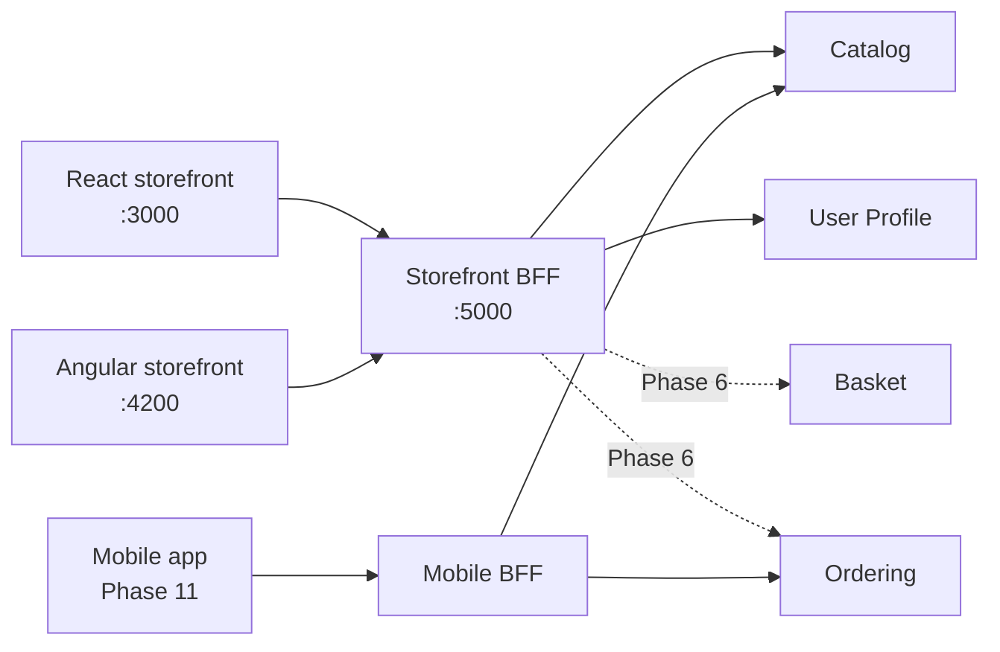

# Storefront BFF

> **Kind:** Gateway (Backend-for-Frontend) · **Port:** 5000 · **Store:** none
> **Code:** [`src/gateways/storefront-bff/ECommerce.StorefrontBff`](../../src/gateways/storefront-bff/ECommerce.StorefrontBff/)
> **Related:** [ADR-0006 — BFF per client experience](../adr/0006-bff-per-client.md) ·
> [concepts-explained.md §7](../concepts-explained.md) · [Architecture](../architecture.md)

## What a BFF is, in plain English

**Backend-for-Frontend.** One backend built for **one kind of client**, owned by the team that builds that
client.

The storefront needs "the product page": name, price, images, stock, breadcrumbs. Behind that sit three or
four services. Without a BFF the browser makes four calls, knows all four hostnames, and every UI change
becomes a coordination exercise across four teams. With a BFF the browser makes **one** call to **one** host
and the BFF does the fan-out server-side, on a fast internal network.

**A BFF is not an API gateway.** A gateway is one shared component for everybody, and it accretes special
cases until nobody dares change it. A BFF is deliberately *not* shared: this one may add a field the web
storefront wants tomorrow without asking the mobile team, because the mobile app has its own.

### One per client *experience*, not per framework

This repo has **two** storefronts, React and Angular, and they share **one** BFF.

That is the rule, and it is easy to get wrong. React and Angular render the same screens, need the same data
in the same shape, and change together. They are one *experience* in two technologies. Splitting the BFF by
framework would duplicate every endpoint for no gain and let the two apps drift apart — the exact drift the
[parity suite](../../tests/e2e/) exists to prevent.

A **mobile** BFF is justified (Phase 11): smaller payloads, different pagination, push-notification
registration, a version-skew problem the web does not have because you cannot force an app-store update.
Different needs, different backend.



---

## Implementation: YARP

[YARP](https://microsoft.github.io/reverse-proxy/) is Microsoft's reverse proxy **as a library**, so routing
lives in configuration next to the code that owns it rather than in a separate infrastructure product.

Today every route is a straight pass-through, so the BFF is configuration only. From Phase 6 it gains
composed endpoints — "the checkout page" merging basket, profile addresses and catalog data into one
response — and those are written as ordinary minimal-API handlers alongside the proxy routes. **Proxy what
maps one-to-one; write code where the client needs a shape no single service has.**

### Routes

| Route | Methods | Auth | Destination |
|-------|---------|------|-------------|
| `/api/catalog/{**catch-all}` | **`GET` only** | anonymous | `catalog-api:8080` |
| `/api/profile/{**catch-all}` | all | **`authenticated`** policy | `user-profile-api:8080` |

### `Methods: ["GET"]` is a security control, not tidiness

```jsonc
"catalog-browse": {
  "ClusterId": "catalog",
  "Match": { "Path": "/api/catalog/{**catch-all}", "Methods": ["GET"] }
}
```

Catalog *will* grow `POST`/`PUT`/`DELETE` for the admin panel in Phase 9. Those endpoints must be reachable
from the **Admin** BFF and never from the public storefront. Whitelisting the verb here means a future admin
endpoint is unreachable through this door **by default** — if someone forgets to guard it, the storefront
still cannot reach it.

The alternative, a catch-all route that forwards everything and trusts each service's own checks, works right
up until one service forgets. **Defence in depth: one door, one purpose, and the narrow default is the safe
one.**

### The `authenticated` policy on the profile route

```jsonc
"profile": {
  "ClusterId": "user-profile",
  "Match": { "Path": "/api/profile/{**catch-all}" },
  "AuthorizationPolicy": "authenticated"
}
```

An anonymous request is rejected **at the edge** with `401`, without a hop to User Profile. Two benefits:
unauthenticated traffic never reaches an internal service, and a trivially rejectable request costs one
network hop instead of two.

This is **not** a replacement for the service's own checks. User Profile independently validates the token
and requires `profile:read:own` / `profile:write:own`. The BFF asks *"are you signed in?"*; the service asks
*"may you do this, and to whose data?"*. If the BFF were the only check, anything that ever reached the
service by another path — another gateway, a misconfigured network policy, a developer with `curl` — would be
unauthenticated. **The gateway is a filter, not a guard.**

### Token forwarding

YARP forwards the `Authorization` header untouched. The BFF does **not** exchange, re-sign or strip the
token; downstream services validate the original Keycloak-issued JWT themselves. Every service therefore
sees the real caller, which is what makes per-service permission checks meaningful and audit logs true.

### Cluster health checks

```jsonc
"HealthCheck": {
  "Active": { "Enabled": true, "Interval": "00:00:15", "Path": "/health/ready" }
}
```

YARP polls each destination's **readiness** probe and removes unhealthy ones from rotation. With one replica
this only converts a slow timeout into a fast failure; with several it is what stops traffic reaching an
instance that is still migrating its database.

`ActivityTimeout: 00:00:10` bounds how long a hung downstream can hold a BFF request open. Without it a slow
service exhausts the BFF's connections and takes the whole storefront down with it — the classic cascading
failure that [Polly's circuit breaker](../concepts-explained.md) is the second line of defence against.

---

## CORS

```jsonc
"Cors": { "Origins": ["http://localhost:3000", "http://localhost:4200"] }
```

An **explicit allow-list** — both storefronts, nothing else. `AllowAnyOrigin()` is the reflex fix when a
browser complains, and it is wrong here: with credentials in play it lets any page on the internet make
authenticated calls on a signed-in user's behalf.

Production origins come from configuration, not code. See [deployment](../operations/deployment.md).

---

## Configuration

| Key | Default (compose) | Notes |
|-----|-------------------|-------|
| `Services__Catalog` | `http://catalog-api:8080` | Container-network name |
| `Services__UserProfile` | `http://user-profile-api:8080` | |
| `Cors__Origins__0..n` | the two storefronts | Explicit list |
| `Auth__Authority` | `http://keycloak:8080/realms/ecommerce` | For the `authenticated` policy |
| `Auth__Audience` | `ecommerce-api` | |

---

## Health

| Probe | Route | Checks |
|-------|-------|--------|
| Liveness | `/health/live` | Process is up |
| Readiness | `/health/ready` | Self only — **not** downstream services |

Readiness deliberately does **not** aggregate downstream health. If it did, one sick service would mark the
BFF not-ready, the orchestrator would pull it from the load balancer, and the *entire* storefront would go
dark over one failing dependency. Catalog being down should break product browsing and nothing else.
Per-cluster health checks handle downstream state; readiness answers only "can this process serve traffic".

---

## What it deliberately does not do

| Not here | Where | Why |
|----------|-------|-----|
| Business rules | The owning service | A rule in the gateway is a rule the service can be bypassed to break |
| Its own database | — | A stateless gateway scales horizontally and has nothing to back up |
| Authorization decisions | Each service | It checks *authenticated*; services check *authorized* |
| Serving the SPA files | nginx, in the web image | Static files and API composition are different jobs with different scaling and caching needs |

---

## Testing

Covered indirectly but thoroughly: every one of the 34 [e2e specs](../../tests/e2e/) reaches its data through
this BFF, against both storefronts. A routing or CORS regression fails the suite immediately.
