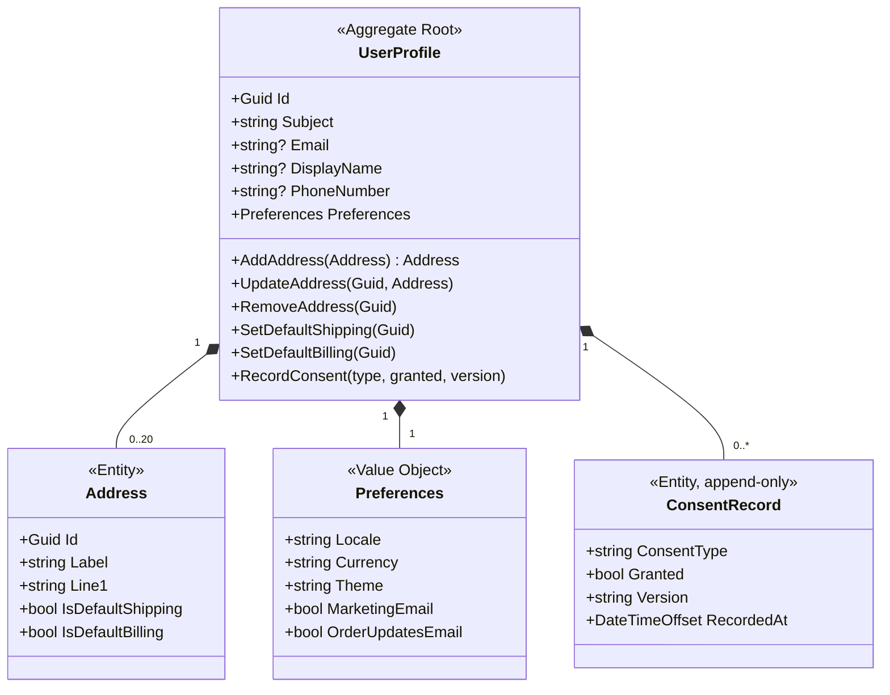

# User Profile service

> **Bounded context:** Identity & Access (supporting) · **Port:** 5006 · **Store:** PostgreSQL
> **Code:** [`src/services/user-profile/ECommerce.UserProfile.Api`](../../src/services/user-profile/ECommerce.UserProfile.Api/)
> **Related:** [Bounded contexts](../domain/bounded-contexts.md) · [Authorization model](../authorization-model.md) ·
> [ADR-0004 — Keycloak as the identity provider](../adr/0004-keycloak-identity-provider.md)

## Purpose

Everything the shop knows about a customer **that is not their login**: display name, phone number, saved
addresses, locale/currency/theme preferences, and marketing consent history.

Keycloak owns *who you are*. This service owns *what the shop remembers about you*. Those are two different
jobs and the split is the whole design.

### What it deliberately does not own

| Not here | Where it lives | Why |
|----------|----------------|-----|
| Password, MFA, sessions | Keycloak | Credential handling is a solved, high-risk problem. Writing our own is how breaches happen. |
| Email address *as a login* | Keycloak | Changing it changes how you sign in — it belongs in account security, not a profile form. We store a **copy** for display and never treat ours as authoritative. |
| Roles and permissions | Keycloak realm roles | See [authorization-model.md](../authorization-model.md). A profile row granting privileges would be a second, weaker authorization system. |
| Order history | Ordering | A profile is not a customer 360 view. Ordering answers "what did they buy". |
| Basket | Basket | Ephemeral, Redis, expires. Nothing about it belongs in durable profile state. |

### Why this service exists at all

A fair objection: *Keycloak has a user-attributes store, so why a whole service?*

Because attributes are untyped key/value strings with no invariants. "At most one default shipping address"
cannot be expressed there; neither can an append-only consent log. Putting shopping data in the IdP also
couples every future change to a security-critical component, and makes the IdP a runtime dependency for
rendering an address book. The rule of thumb: **the IdP holds what it needs to authenticate you; the domain
holds what the business needs to serve you.**

---

## Domain model

One aggregate, `UserProfile`, with `Address` and `ConsentRecord` inside its boundary.



### `Subject` is the real key

`Subject` is the Keycloak `sub` claim — an opaque, immutable GUID. Every lookup is by `sub`, never by email.

Email changes. People marry, leave employers, consolidate accounts. Any system that keys a customer by email
eventually merges two strangers or orphans somebody's order history. `sub` never changes for the life of the
account, which is exactly what a foreign key needs.

The profile row also carries an `Id` of its own so that other services can reference a profile without
depending on Keycloak's identifier format.

### Why `Address` is an entity, not a value object

`Preferences` is a value object: replacing "GBP" with "EUR" is a *different* set of preferences and nothing
needs to know it is the "same" preferences object. It has no identity.

`Address` is an entity because it has one. Correcting a typo in a postcode does not create a new address —
it is still *your home address*, still the default shipping target, and a future order may already reference
it. Identity survives the change of every field, which is the definition of an entity.

The consequence: `Address` has an `Id` and lives in a collection the aggregate controls. Its default-flag
mutators are **`internal`**, so only `UserProfile` can set them:

```csharp
internal void MarkAsDefaultShipping() => IsDefaultShipping = true;
```

An endpoint physically cannot flip that flag directly and skip the "clear the previous default" step. The
compiler enforces what a code review would otherwise have to catch.

### Invariants, and where they live

All of them sit **inside the aggregate**, not in the endpoint:

| Invariant | Enforced by |
|-----------|-------------|
| At most **one** default shipping address, and one default billing | `AddAddress`, `UpdateAddress`, `SetDefault*` all clear the previous one first |
| The **first** address becomes the default for both | `AddAddress` — a customer with one address and no default would be asked to pick from a list of one at checkout |
| Removing a default **promotes** another address | `RemoveAddress` — leaving a profile with addresses but no default produces a checkout page with nothing preselected |
| At most **20** addresses | `AddAddress` guard — an unbounded collection loaded on every request is a slow denial-of-service against yourself |
| An address must belong to *this* profile | `FindAddress` throws `DomainException` — this is the check that stops one customer editing another's address by guessing an id |
| Marketing consent defaults **off** | `Preferences.Default()` — see below |
| Consent history is **append-only** | `RecordConsent` adds; nothing updates or deletes |

> **This is the point of DDD in one table.** A second entry point — an admin tool, a CSV import, a data-fix
> script — goes through the same methods and obeys the same rules. Validation written in an HTTP handler
> protects exactly one caller.

### Marketing defaults to off; order updates default to on

```csharp
public bool MarketingEmail { get; private set; }              // false
public bool OrderUpdatesEmail { get; private set; } = true;   // true
```

Not a style choice. Under UK GDPR / PECR, marketing requires **opt-in** — a pre-ticked box is not consent.
An order confirmation is *service communication*: part of performing the contract you entered by buying
something, and not something you can opt out of while still expecting a receipt.

The UI keeps them in two separate `<fieldset>` groups for the same reason, and an e2e spec asserts it. Merged
into one "notifications" toggle, unsubscribing from adverts would also silence your dispatch email — the
common mistake this design is arranged to prevent.

### Consent is a log, not a flag

`RecordConsent(type, granted, version)` **appends**. Withdrawing consent writes a new row with
`granted = false`; it never deletes the old one. `CurrentConsent(type)` reads the latest.

"When did they consent, and to what wording?" is a question regulators actually ask. A boolean column answers
neither. `Version` pins which privacy-notice text they agreed to, so a later rewording does not retroactively
claim they agreed to it.

---

## Persistence

EF Core with PostgreSQL. Three tables: `UserProfiles`, `Addresses`, `ConsentRecords`.

### Schema decisions worth defending

**`Subject` is uniquely indexed.** It is the lookup key on every single request. Without the index, every
page load is a sequential scan.

**`Preferences` is `OwnsOne`, not a table.** An owned type maps to columns on the parent row
(`preferences_currency`, `preferences_marketing_email`, …). A value object has no identity, so giving it a
primary key and a join would be modelling a concept that does not exist — and would cost a join on the
hottest read in the service.

**No snake_case naming convention here — deliberately, unlike Catalog.** Catalog applies a global
snake_case convention because its read side is hand-written Dapper SQL, where PostgreSQL's unquoted-identifier
lowercasing makes `ProductId` a runtime error waiting to happen. This service has no hand-written SQL: EF
quotes every identifier it generates, so the convention buys nothing — and it actively **breaks** the owned
`Preferences` type, whose shadow key must map to the owner's primary-key column and stops doing so when a
convention renames it underneath.

> Consistency across services is worth less than each service being right. The divergence is documented in
> both `DbContext` files so the next reader sees the reason rather than an inconsistency.

**All three keys are `ValueGeneratedNever()`.** The single most expensive bug of this phase — see below.

### The `ValueGeneratedNever` bug

Saving an address failed with:

```
DbUpdateConcurrencyException: expected to affect 1 row(s), but actually affected 0 row(s)
```

The domain generates identifiers in its constructors:

```csharp
Id = Guid.CreateVersion7();
```

EF Core infers entity state from the key: **default value → `Added`, non-default → `Unchanged`/`Modified`**.
Because the constructor had already assigned a real GUID, EF concluded the row existed and issued an
`UPDATE … WHERE id = …` for a row that had never been inserted. Zero rows matched, and EF reported that as a
concurrency conflict — a genuinely misleading error for the actual cause.

`ValueGeneratedNever()` tells EF "I own this key, never assume anything from its value", and the state comes
from `Add()`/`Update()` as it should.

**How it was actually found**, because the method matters more than the fix: three hypotheses in a row were
wrong. Guessing stopped, and a diagnostic catch went in:

```csharp
catch (DbUpdateConcurrencyException ex)
{
    var e = ex.Entries[0];
    // reports e.Metadata.Name and e.State
}
```

That printed `Address = Modified` on the first run and the cause was obvious immediately. **Ask the runtime
instead of the rubber duck.**

> A second lesson hides inside the first: the reason the first three attempts saw no SQL in the logs was
> that `MinimumLevel.Override` ran *after* `ReadFrom.Configuration` in the Serilog setup, so the
> `Serilog__MinimumLevel__Override__...` environment variable silently did nothing. Fixed in
> [`ObservabilityExtensions.cs`](../../src/building-blocks/Observability/ObservabilityExtensions.cs) —
> a logging configuration that fails silently costs more than one that fails loudly.

### Why `Guid.CreateVersion7()`

Version 7 GUIDs are **time-ordered**. Random v4 keys scatter inserts across a B-tree, fragmenting the index
and thrashing the page cache. V7 keys append, which keeps the index compact — while remaining unguessable
enough not to leak row counts, and generatable client-side without a database round trip.

---

## Lazy provisioning

**There is no registration endpoint.** Keycloak creates the account; this service creates the profile on the
**first authenticated request that needs it**:

```csharp
UserProfile? profile = await db.UserProfiles.FirstOrDefaultAsync(p => p.Subject == sub, ct);
if (profile is null)
{
    profile = new UserProfile(sub, user.Email, user.Name);
    db.UserProfiles.Add(profile);
    try { await db.SaveChangesAsync(ct); }
    catch (DbUpdateException) { /* lost the race - reload the winner */ }
}
```

Two things this avoids:

**No distributed transaction at sign-up.** The alternative is a Keycloak event listener or webhook that must
create a profile in another service's database. That is a two-phase commit across a security component and a
domain service, and its failure mode — an account with no profile — is silent and permanent.

**No orphan rows.** Users who register and never shop never get a row.

The `catch (DbUpdateException)` is not defensive noise. Two concurrent tabs on first login race, both find
nothing, both insert. The unique index on `Subject` makes the loser fail; it reloads and proceeds. **The
operation is idempotent by construction rather than by luck.**

---

## Endpoint reference

Base path through the BFF: `/api/profile`. Direct: `http://user-profile-api:8080/api/profile`.

Every route is `/me`. **"Me" is resolved server-side from the `sub` claim** — no route takes a user id, and
no request body carries one. There is no `/profile/{userId}` surface to attack.

All routes require `profile:read:own` or `profile:write:own`, which
[every signed-in role holds](../authorization-model.md#4-the-matrix--which-role-grants-what).

| Method | Route | Permission | Purpose |
|--------|-------|-----------|---------|
| `GET` | `/me` | `profile:read:own` | Fetch (and lazily provision) the caller's profile |
| `PUT` | `/me/contact` | `profile:write:own` | Display name and phone number |
| `PUT` | `/me/preferences` | `profile:write:own` | Locale, currency, theme, marketing and order-update channels |
| `POST` | `/me/addresses` | `profile:write:own` | Add an address |
| `PUT` | `/me/addresses/{id}` | `profile:write:own` | Edit an address |
| `DELETE` | `/me/addresses/{id}` | `profile:write:own` | Remove an address |
| `POST` | `/me/addresses/{id}/default-shipping` | `profile:write:own` | Promote to default shipping |
| `POST` | `/me/addresses/{id}/default-billing` | `profile:write:own` | Promote to default billing |

**Every endpoint returns the complete updated profile.** Not a `204`, not a partial patch result. The client
never has to guess what a change did to the rest of the aggregate — and with these invariants a change
routinely touches something the caller did not send. Adding your second address does not change it; adding
your *first* silently makes it the default for both shipping and billing. A `204` would leave the UI showing
a stale, wrong screen until the next refresh.

### `GET /api/profile/me`

```bash
TOKEN=$(curl -s -X POST http://localhost:8080/realms/ecommerce/protocol/openid-connect/token \
  -d grant_type=password -d client_id=ecommerce-web \
  -d username=customer -d password='Passw0rd!' | jq -r .access_token)

curl -s http://localhost:5000/api/profile/me -H "Authorization: Bearer $TOKEN" | jq
```

```jsonc
{
  "id": "0192f4c1-...",
  "subject": "a1b2c3d4-...",        // Keycloak sub
  "email": "customer@example.com",  // display copy; Keycloak is authoritative
  "displayName": "Casey Customer",
  "phoneNumber": null,
  "preferences": {
    "locale": "en-GB", "currency": "GBP", "theme": "system",
    "marketingEmail": false, "marketingSms": false,
    "orderUpdatesEmail": true, "orderUpdatesSms": false
  },
  "addresses": [
    {
      "id": "0192f4c2-...", "label": "Home",
      "line1": "12 Rosewood Avenue", "line2": null,
      "city": "Bristol", "postcode": "BS1 4TP", "country": "GB",
      "isDefaultShipping": true, "isDefaultBilling": true
    }
  ]
}
```

### Status codes

| Code | When |
|------|------|
| `200` | Success. Always carries the full profile. |
| `400` | A domain invariant was violated — 21st address, address id belonging to another profile. `DomainException` → RFC 7807 problem detail. |
| `401` | No token, expired token, or a token signed by a key the service does not recognise. |
| `403` | Valid token without the permission. |
| `404` | Never returned for the profile itself — `GET /me` provisions instead. Returned for an unknown address id. |

---

## Dependencies

| Direction | What | Kind |
|-----------|------|------|
| Inbound | Storefront BFF (YARP, `profile` route, `authenticated` policy) | Synchronous HTTP |
| Outbound | PostgreSQL `userprofile` database | Synchronous |
| Outbound | Keycloak JWKS, for token signature validation | Synchronous, cached |

**No outbound calls to other services**, and nothing calls it during checkout. Ordering will **copy** the
shipping address onto the order rather than referencing it, so that editing your address next year does not
rewrite where last year's parcel went. That copy is a deliberate denormalisation and belongs to Phase 6.

### Events

None yet. `ProfileUpdated` would be published when Notification needs to react to a channel change — added
in Phase 7 with the rest of the event surface, not speculatively now.

---

## Configuration

| Key | Default (compose) | Notes |
|-----|-------------------|-------|
| `ConnectionStrings__UserProfileDb` | `Host=userprofile-db;…` | Injected from `deploy/.env`; never committed |
| `Auth__Authority` | `http://keycloak:8080/realms/ecommerce` | Container-network address |
| `Auth__Audience` | `ecommerce-api` | Must match the audience protocol mapper |
| `OTEL_EXPORTER_OTLP_ENDPOINT` | `http://otel-collector:4317` | Traces and metrics |

---

## Health

| Probe | Route | Checks |
|-------|-------|--------|
| Liveness | `/health/live` | Process is up. Never touches the database — a dead dependency should not trigger a restart loop that cannot fix it. |
| Readiness | `/health/ready` | Database reachable and migrated. |

---

## Testing

| Layer | Where | Covers |
|-------|-------|--------|
| Domain unit | [`tests/unit`](../../tests/unit/) | Every invariant above, directly against the aggregate — no database, no HTTP |
| Authorization | [`ECommerce.Auth.IntegrationTests`](../../tests/integration/ECommerce.Auth.IntegrationTests/) | Real Keycloak in Testcontainers, real signed tokens |
| End-to-end | [`tests/e2e/specs/account.spec.ts`](../../tests/e2e/specs/account.spec.ts) | 9 specs, run against **both** storefronts |

The e2e specs sign in as a **different seed user per mutating test**. Sharing one user makes tests
order-dependent, which is how a suite becomes flaky and then ignored. That choice is what surfaced the
missing staff `profile:*:own` permissions described in
[the authorization model](../authorization-model.md#4-the-matrix--which-role-grants-what).

---

## Operational gotcha: re-importing the realm

Keycloak imports `realm-export.json` **only on first start**. Forcing a re-import means removing the
container *and its volume*:

```powershell
docker compose rm -sf keycloak keycloak-db
docker volume rm ecommerce_keycloak-db-data
docker compose up -d --wait keycloak
```

A fresh realm gets **fresh signing keys**, so every service still holds a stale JWKS and every request fails
with `401` until they refresh. Restart them:

```powershell
docker compose restart user-profile-api storefront-bff catalog-api
```

This is not merely a local annoyance — it is what an IdP key rotation looks like in production, and the reason
services should refresh JWKS on an unknown `kid` rather than only on a timer.
